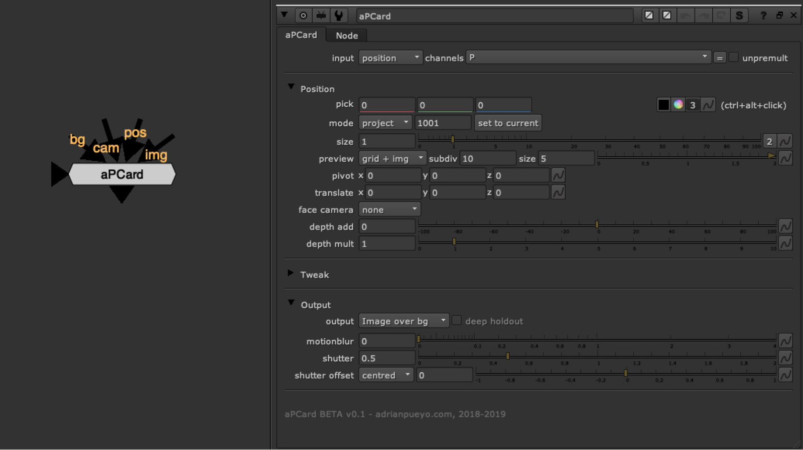

# aPCard AP

**Author:** Adrian Pueyo - [http://www.adrianpueyo.com/](http://www.adrianpueyo.com/)

aPCard helps you quickly place a card using CG render passes. Use either: Position Pass, Depth pass, Deep data, or geometry. Ctrl+alt click to sample image data in order to place the 3d card. From there you can set a reference frame, face the card to the camera (on ref frame or permanently) and you can choose the mode of either projection or just place the card (so the texture will be in card UV space).

When you are previewing the card placement, it provides a handy grid for quick placement and size/orientation checking.

You can also use additional deep data to do a deep holdout of the card, in case it needs to go behind/between some 3d objects.
