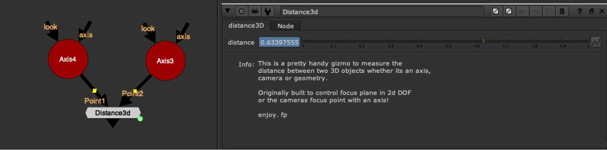

# Distance3D NKPD

**Author:** Falko Paeper

- [http://www.nukepedia.com/gizmos/3d/distance3d_v02_fp](http://www.nukepedia.com/gizmos/3d/distance3d_v02_fp)

This is a pretty handy gizmo to measure the distance between two 3D objects whether it's an axis, camera or geometry.

Originally built to control focus plane in 2D DOF or the camera's focus point with an axis!
