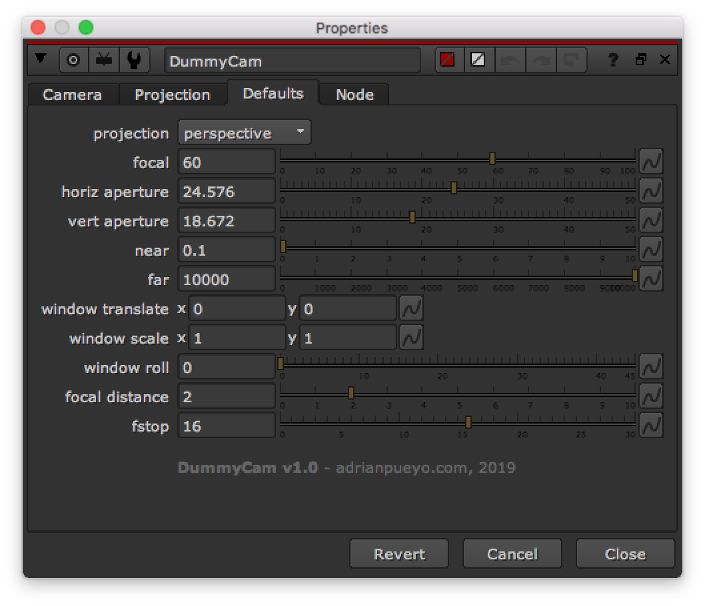

# DummyCam AP

**Author:** Adrian Pueyo - [http://www.adrianpueyo.com/](http://www.adrianpueyo.com/)

- [http://www.nukepedia.com/gizmos/3d/dummycam](http://www.nukepedia.com/gizmos/3d/dummycam)

DummyCam is a Camera that apart from the matrices also grabs all the 'Projection' values from the upstream camera that it's connected to. Has a 'Defaults' tab with the knob values to use if there's no Camera connected. It can also be used inside of groups, as many levels deep as you want. All using live and super fast TCL.

DummyCam is mainly meant for making gizmos that require a Camera input, as there is currently no other way to look for the Projection values upstream, and it is usually solved with ugly callbacks, with a Python button, or looking for the topnode, which only works as long as you don't plug an axis to the top camera, etc. Simply put it inside the Group, plugged to the cam Input node, and voilà.
*Special thanks to Ernest Dios, we decyphered the undocumented parts of the code together.*
