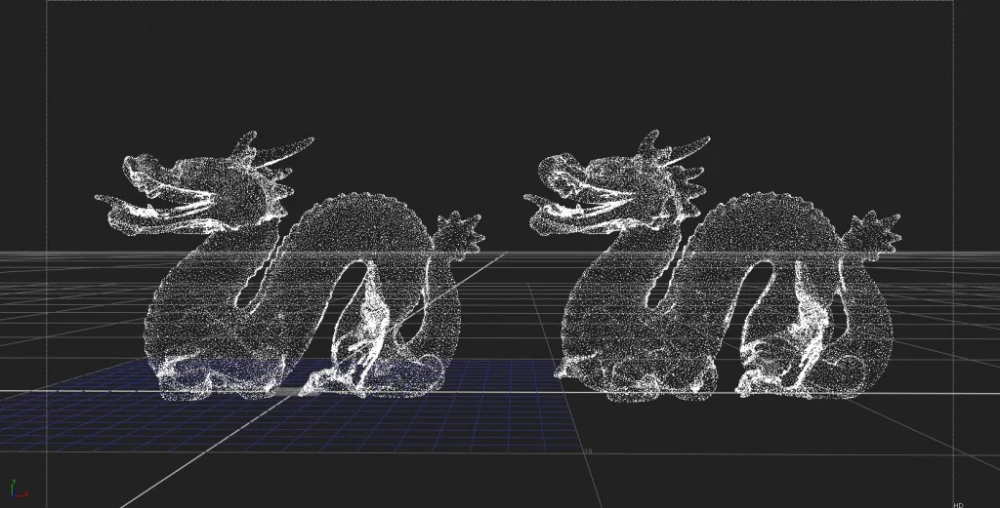
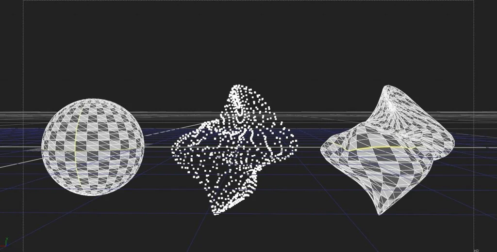

# GeoToPoints MHD

**Author:** Mads Hagbarth Damsbo - [https://hagbarth.net/blog/](https://hagbarth.net/blog/)

- [https://hagbarth.net/major-bug-in-nukes-particle-system/](https://hagbarth.net/major-bug-in-nukes-particle-system/)
- [http://www.hagbarth.net/nuke/GeoToPoints.nk](http://www.hagbarth.net/nuke/GeoToPoints.nk)

Creates a point cloud based on input Geo vertices.

