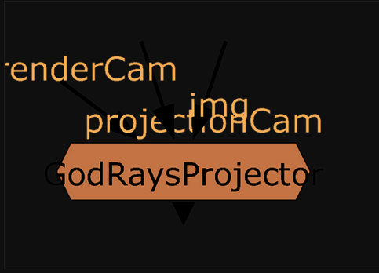
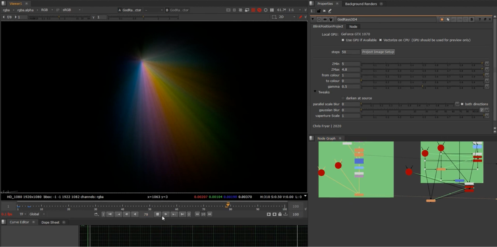

# GodRaysProjector CF

**Author:** Chris Fryer - [https://www.chrisfryer.co.uk/blog](https://www.chrisfryer.co.uk/blog)

- [https://www.chrisfryer.co.uk/post/godraysprojector](https://www.chrisfryer.co.uk/post/godraysprojector)
- [https://www.chrisfryer.co.uk/post/godraysprojector-shadows-and-a-total-rebuild](https://www.chrisfryer.co.uk/post/godraysprojector-shadows-and-a-total-rebuild)
- Video: [https://vimeo.com/476747690](https://vimeo.com/476747690)
- Video: [https://vimeo.com/519293235](https://vimeo.com/519293235)

GodRaysProjector is a 3D alternative to the generally 2D Godrays node. By connecting a renderCamera, projectionCamera and an image to project. Thanks to the wonders of BlinkScript it also has a wicked-fast GPU preview!

I decided to completely rebuild GodRaysProjector and clean up a lot of the bugs and quirks. This also gave me a chance to make the code super-readable for people who are starting out with Blinkscript and want some easy to read examples.

The biggest feature of this update is the shadow functionality, this uses a couple neat tricks to produce a 2D shadow solution, with the information we'd generally have for a shot.

