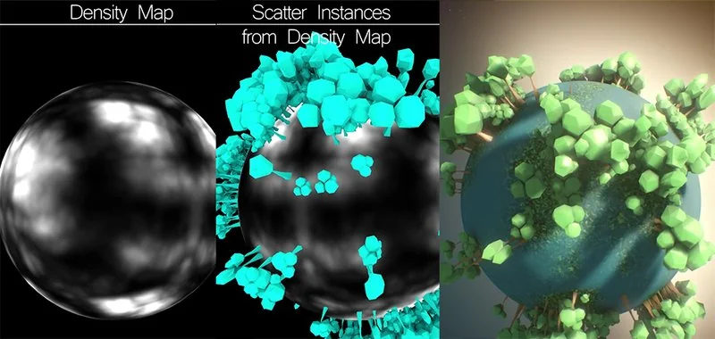
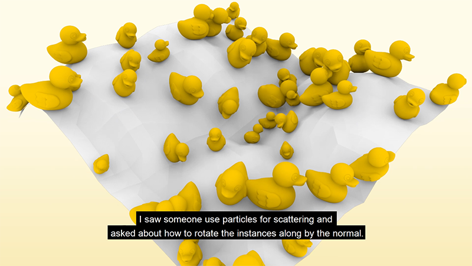

# mScatterGeo MJT

**Author:** Mark Joey Tang - [https://www.facebook.com/MJTLab](https://www.facebook.com/MJTLab)

- [http://www.nukepedia.com/gizmos/3d/mscattergeo](http://www.nukepedia.com/gizmos/3d/mscattergeo)
- [http://bit.ly/menupy](http://bit.ly/menupy)
- Video: [https://youtu.be/_v-6UR_Mkj4](https://youtu.be/_v-6UR_Mkj4)
- Video: [https://youtu.be/EWjjN05bsS8](https://youtu.be/EWjjN05bsS8)

mScatterGeo supports scattering on geo's vertices, faces and density map in nuke. 2 rotation types available, 'look At' and 'normals'. Variation of size, rotation, texture and instance geo can be set.

