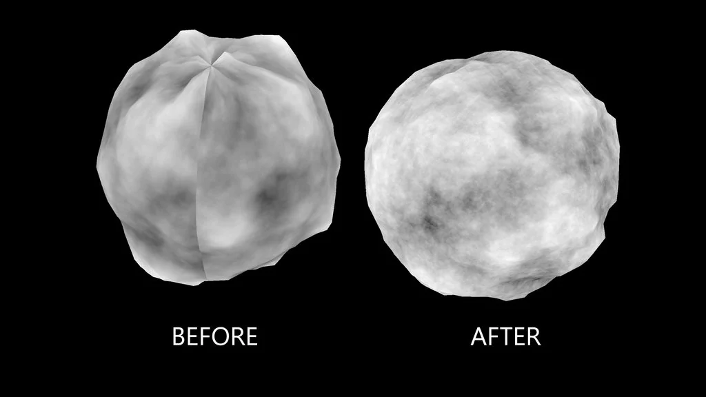

# Noise3DTexture NKPD

**Author:** Ben Sumner

- [http://www.nukepedia.com/gizmos/3d/bs_noise3d](http://www.nukepedia.com/gizmos/3d/bs_noise3d)

This Gizmo outputs either the input geometry with a 3D world position noise applied as a texture, or it can output the texture itself in the UV space of the model.
**Your model must have UVs!**
You can output noise or textured model, either with the originally applied alpha, solid white alpha, or with the generated noise in the alpha channel.

This node is a good way to get seamless noise textures on your 3D models, or to export a texture to be used for seamless displacement.
