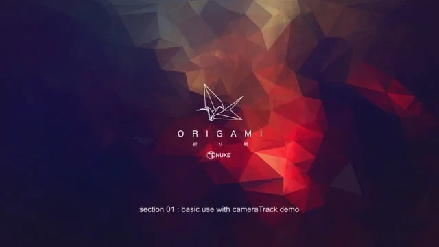
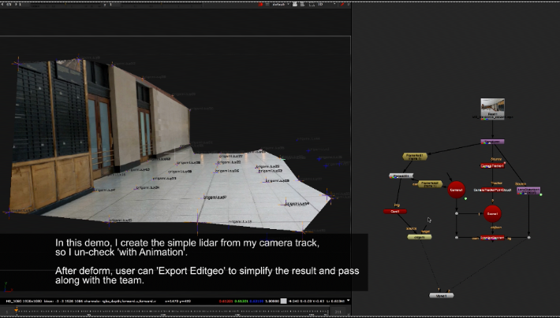
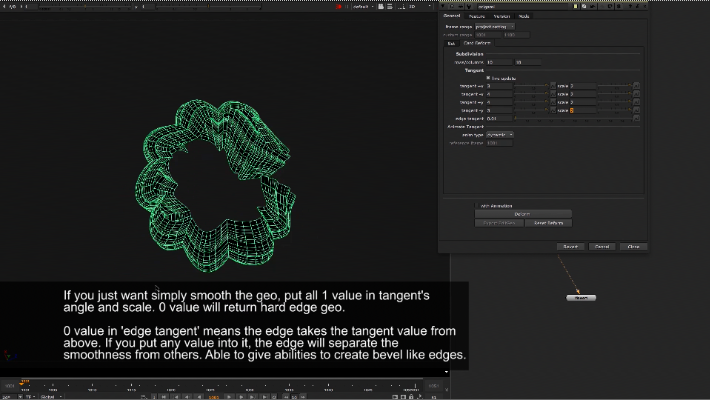
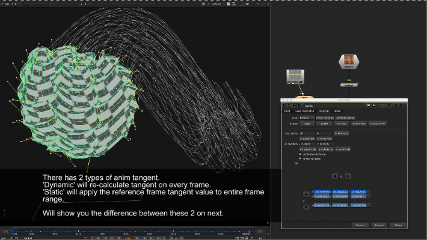
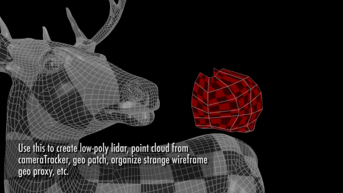
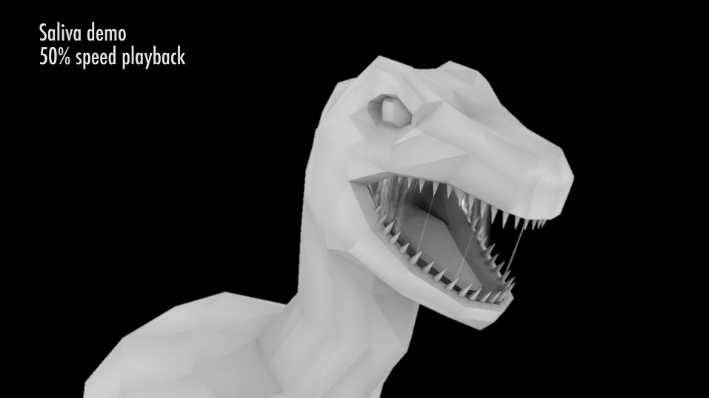
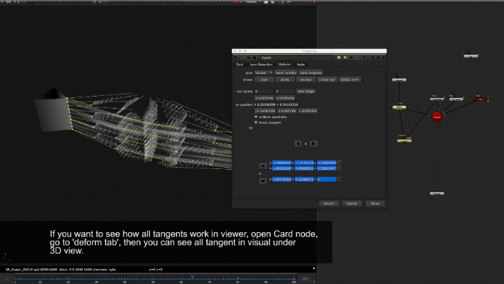
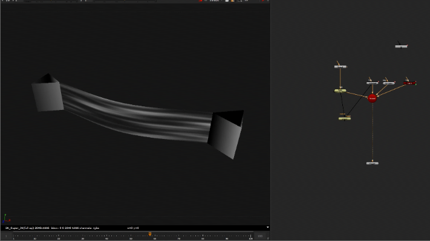

# Origami MJT

**Author:** Mark Joey Tang - [https://www.facebook.com/MJTLab](https://www.facebook.com/MJTLab)

- [http://www.nukepedia.com/gizmos/3d/origami](http://www.nukepedia.com/gizmos/3d/origami)
- [http://bit.ly/menupy](http://bit.ly/menupy)
- Video: [https://vimeo.com/318138533](https://vimeo.com/318138533)

Initial intention of 'Origami' is a *just for fun* tool. Since the tool involved many setup. Then I start to build it for practical usage. It helps to build geo patch for scatter objects or form a new UV, re-build a messy wireframe photoscan geo, clone a high-end geo to low-end geo for patch or 3D reference, and also able to create interact animation. v1.2 added tangent for geo smoothness.
### Example case of using Origami:
Create fake new UV for texturing in nuke:
[https://www.facebook.com/pg/MJTlab/photos/?tab=album&album_id=415866105661883](https://www.facebook.com/pg/MJTlab/photos/?tab=album&album_id=415866105661883)

