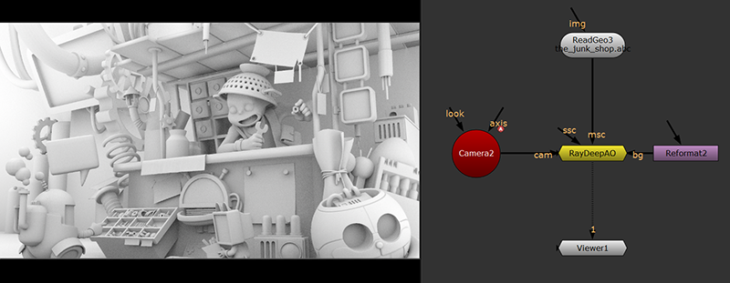
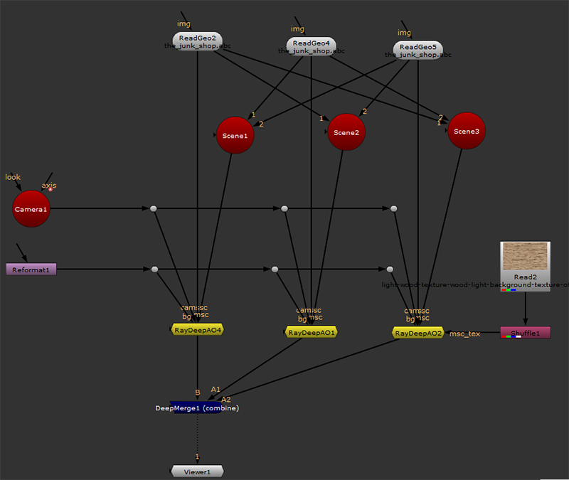
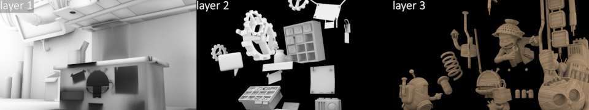
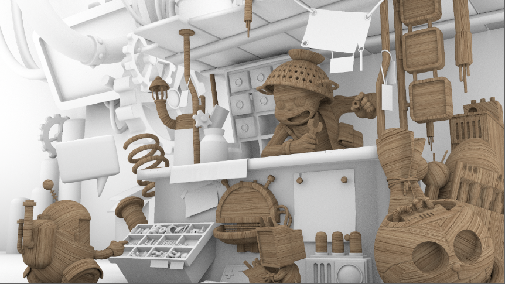

# RayDeepAO MJT

**Author:** Mark Joey Tang - [https://www.facebook.com/MJTLab](https://www.facebook.com/MJTLab)

- [http://www.nukepedia.com/gizmos/3d/raydeepao](http://www.nukepedia.com/gizmos/3d/raydeepao)
- [http://bit.ly/menupy](http://bit.ly/menupy)

A setup to render Ambient Occlusion from Geo to deep format, able to set non-renderable objects.

Create all in layers, so the main scene can interact with other geos but not holdout by them.
### Inputs:
- **cam:** connect with camera node
- **bg:** define the output resolution
- **msc:** stand for 'main scene', which is the primary geo(s) to render AO. Input can be a single geo or a scene node connected to multiple geos.
- **ssc:** stand for 'sub scene', which is setup non-renderable geo(s) but they interact with the primary geo(s). Input can be a single geo or a scene node connected to multiple geos.
- **msc_tex:** stand for 'main scene texture'. This input will be used when 'use texture' is checked. Texture required in UV space.
### Output:
Output is in deep format. If output vector is checked, position and normal data is also in deep format.

