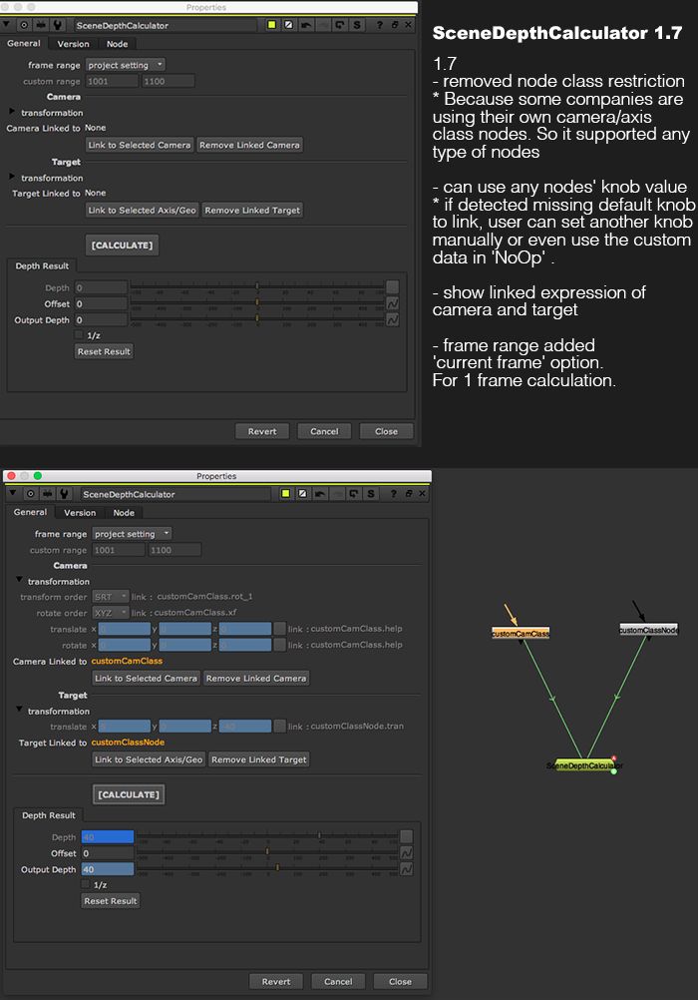

# SceneDepthCalculator MJT

**Author:** Mark Joey Tang - [https://www.facebook.com/MJTLab](https://www.facebook.com/MJTLab)

- [http://www.nukepedia.com/gizmos/3d/scenedepthcalculator](http://www.nukepedia.com/gizmos/3d/scenedepthcalculator)
- [http://bit.ly/menupy](http://bit.ly/menupy)

SceneDepthCalculator for calculate the depth value from camera to object. It useful for any depth tool, mostly common for rack defocus. I am also using this to drive all 2D nodes while setup template. Use lidar and camera to calculate the shot scale, and use the scale ratio to drive all 2D nodes in template base on the key shot. So it will get the consistent look from the key shot.

