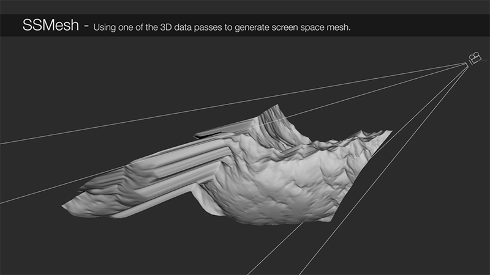

# SSMesh MJT

**Author:** Mark Joey Tang - [https://www.facebook.com/MJTLab](https://www.facebook.com/MJTLab)

- [https://www.nukepedia.com/gizmos/3d/ssmesh](https://www.nukepedia.com/gizmos/3d/ssmesh)
- [http://bit.ly/menupy](http://bit.ly/menupy)
- Video: [https://vimeo.com/356083546](https://vimeo.com/356083546)

Using Position, depth or deep data to convert screen space mesh. Since pointcloud is pixel base 3D coordinate data, and it changes on every frame. So SSMesh helps to convert those data to vector data and process any vector tools.

