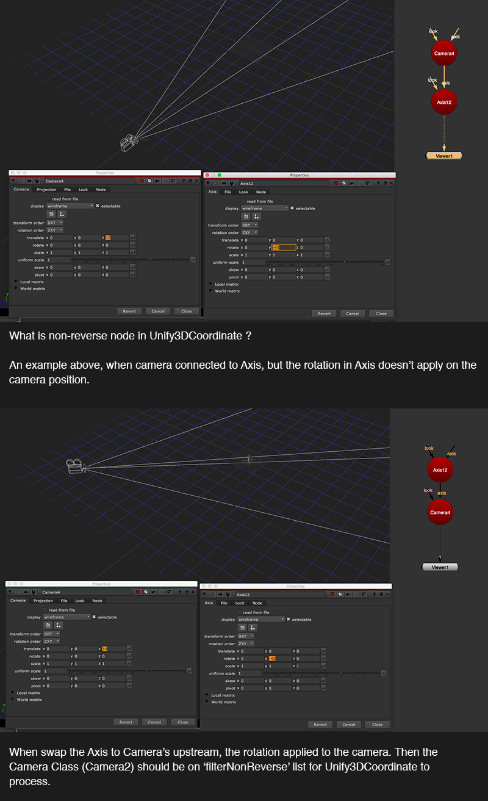

# Unify3DCoordinate MJT

**Author:** Mark Joey Tang - [https://www.facebook.com/MJTLab](https://www.facebook.com/MJTLab)

- [http://www.nukepedia.com/gizmos/3d/unify3dcoordinate](http://www.nukepedia.com/gizmos/3d/unify3dcoordinate)
- [http://bit.ly/menupy](http://bit.ly/menupy)
- Video: [https://vimeo.com/308083719](https://vimeo.com/308083719)

Unify all the 3D transformation nodes into one single coordinate value. Snap vertex supported animation, shifted pivot, and able to export translation and rotation.

Solve complicated 3D transformation setup and tricky snap vertex, return in one single coordinate value.
### Video content:
- Part01 - introduction & camera demo
- Part02 - geo demo
- Part03 - light demo
- Part04 - snap vertex on readGeo demo

