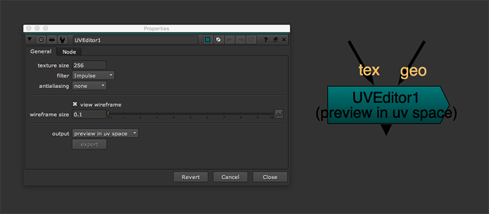
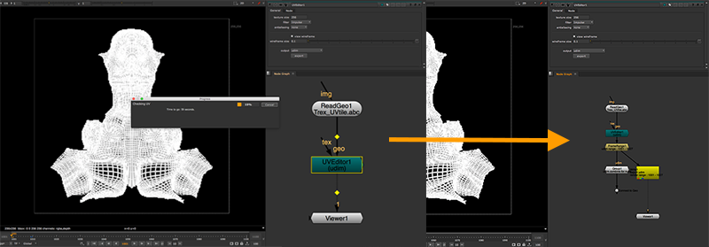
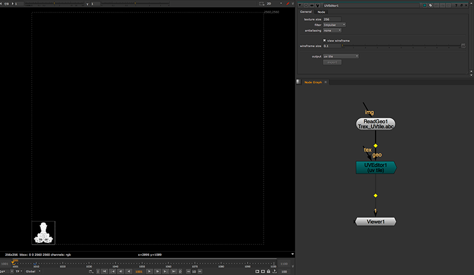
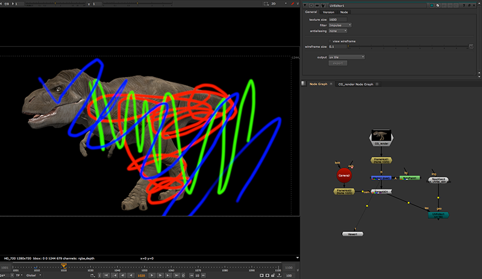
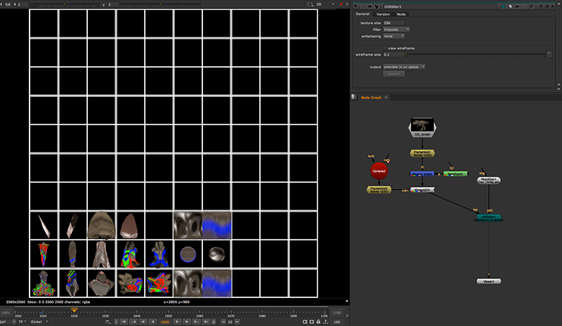
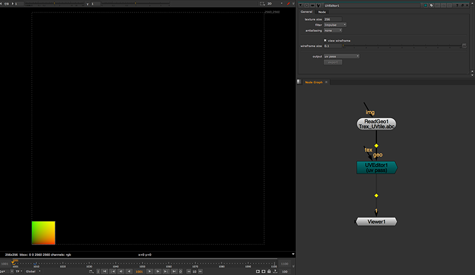

# UVEditor MJT

**Author:** Mark Joey Tang - [https://www.facebook.com/MJTLab](https://www.facebook.com/MJTLab)

- [http://www.nukepedia.com/gizmos/3d/uveditor](http://www.nukepedia.com/gizmos/3d/uveditor)
- [http://bit.ly/menupy](http://bit.ly/menupy)

UVEditor simplifies the steps of creating UV tile or UDIM setup in nuke, provides the visual of UV tile in UV space of the geo, exports UDIM texture, extracts mattepainting projection in UDIM, paint fix the texture and map it back to the geo.

For what is UV tile / UDIM and how to get it works in nuke, please check here:
[https://www.facebook.com/pg/MJTlab/photos/?tab=album&album_id=348648709050290](https://www.facebook.com/pg/MJTlab/photos/?tab=album&album_id=348648709050290)
Download zip included this tool in gizmo and group format, UVEditor_demo.nk, demo geo (please re-link the geo file).
### Controls:
**texture size** - Define the texture resolution in here.
**filter** - UV output has to go through scanlineRender, this filter is same as all the transformation pixel filter
**antialiasing** - UV output has to go through scanlineRender, this antialiasing is same as antialiasing setting as scanlineRender
**show tile number** - Show the number of tile, helps for indicate UDIM frame.
**view wireframe** - Enable this wireframe option will preview UV in wireframe instead of texture. Give user an idea of how the look of geo in UV space.
**wireframe size** - The thickness of wireframe to show. Only enable when view wireframe is checked.
### Output modes:
**preview in UV space** - This will display UV tile in UV space. For preview purpose.
**UDIM** - This will separate UV tile in UDIM format (based on frame number start from 1001). When selected UDIM as output, 'export' button will enable. That will scan through all available UDIM and return the frame range of the UDIM. It will generate a group with all UDIM combined for nuke to work with, and also a write node to show where should render if UDIM need to be export as texture sequence.
**uvtile** - Output the UV in tile format, can map to the geo directly without any process. If user work with uvtile for texture modification, user need to work with overscan size manually.
**uv pass** - Output UV data as texture, same as 3D software will provide in render. Since the tool is working in 10x10 UV tile, so the UV pass will also support 10.0x10.0 UV data. Then user can use this to work with STMap for texture mapping.

