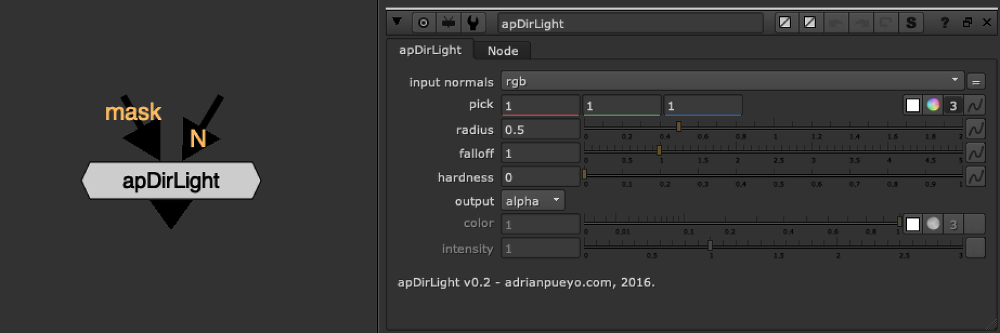
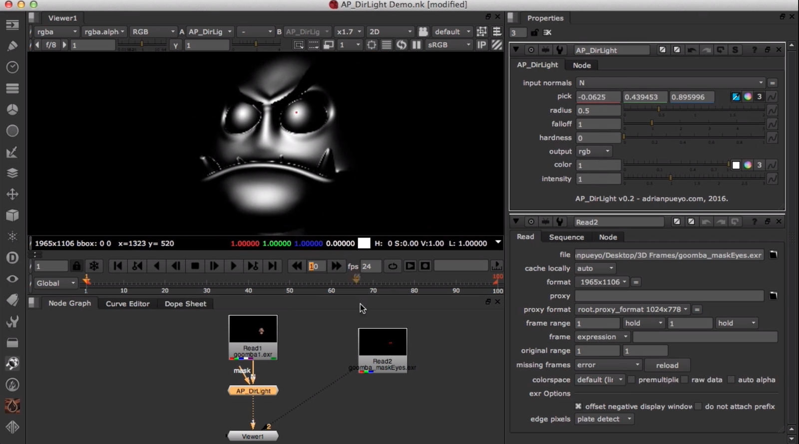

# apDirLight [AP]

**Author:** Adrian Pueyo - [http://www.adrianpueyo.com/](http://www.adrianpueyo.com/)

Simulate a simple directional/infinite light through a normal pass, by picking a Normals pass color and then tweaking the radius, falloff and hardness of the light.

