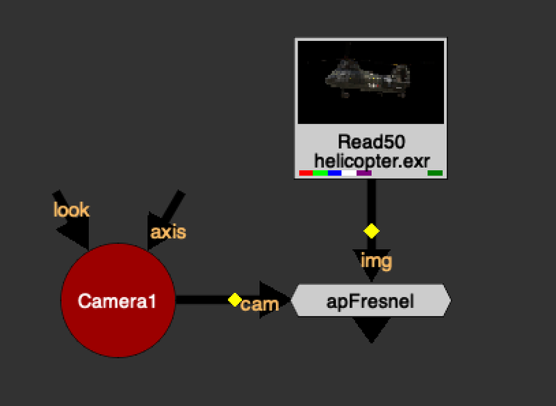
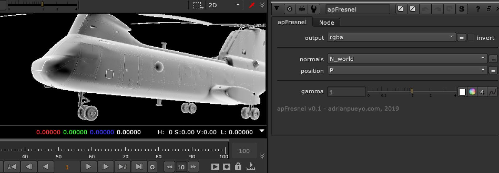

# apFresnel [AP]

**Author:** Adrian Pueyo - [http://www.adrianpueyo.com/](http://www.adrianpueyo.com/)

Convert your Normals Worldspace pass into a Camera Space Fresnel pass.

Plug in your render camera, pick the normals and position channels from the input.

Can adjust the gamma of the Fresnel (Facing ratio).

