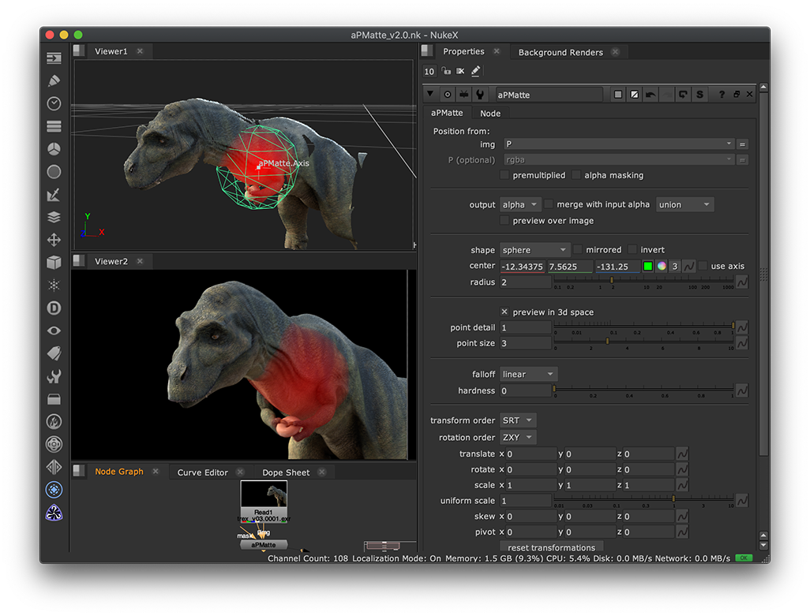

# aPmatte [AP]

**Author:** Adrian Pueyo - [http://www.adrianpueyo.com/](http://www.adrianpueyo.com/)

- [http://www.nukepedia.com/blink/keyer/apmatte](http://www.nukepedia.com/blink/keyer/apmatte)

Blinkscript-based Nuke gizmo for generating mattes or 4D noise from a Position pass.
v2.0 includes:
- New shapes and modes
- A 3D-space view of the matte and point cloud
- Accepts an Axis or Camera input
- Preview the p-matte over an image input
- Merge the alpha with the incoming one through different operations

