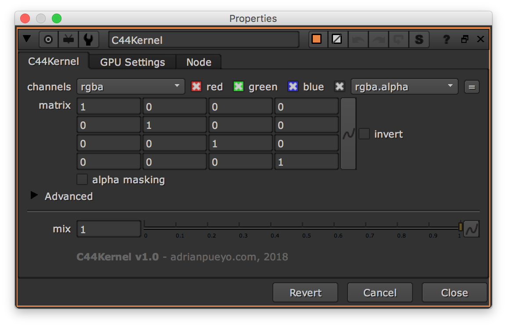

# C44Kernal [AP]

**Author:** Adrian Pueyo - [http://www.adrianpueyo.com/](http://www.adrianpueyo.com/)

- [http://www.nukepedia.com/blink/colour/c44kernel](http://www.nukepedia.com/blink/colour/c44kernel)

Multiply the RGB or RGBA colors by an arbitrary 4x4 Matrix. Useful for transforming vector passes like Position or Normals. You can also plug in an Axis or Camera node into the axis input, to apply its transformations.

C44Kernel is a simpler, Blinkscript-based alternative to the C44Matrix node by Ivan Busquets, which is incredibly useful but has the compatibility limitations of a plugin.
