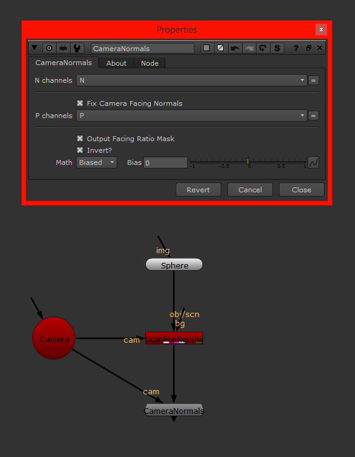
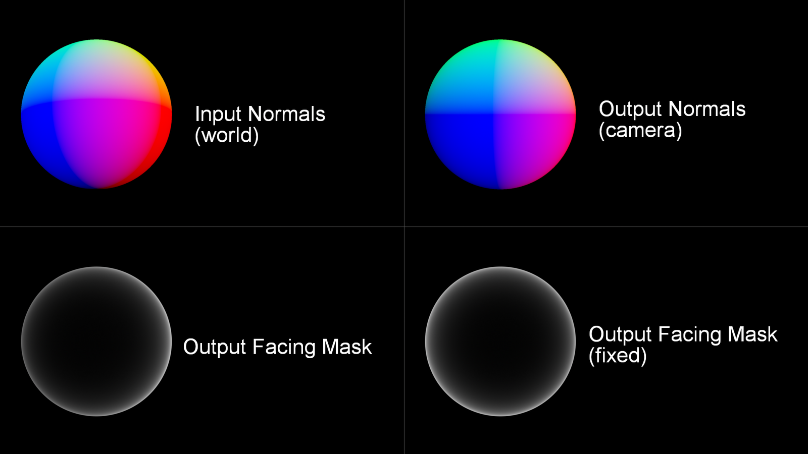

# CameraNormals [NKPD]

**Author:** Nikolai Wüstemann

- [http://www.nukepedia.com/gizmos/channel/cameranormals](http://www.nukepedia.com/gizmos/channel/cameranormals)

The Gizmo lets you convert your CG worldspace normals to camera space normals.

As the blue component of camera space normals is often used as a facing ratio, you also have the option to directly output the mask.

In addition you have some control about the facing mask falloff (Simple or Biased), that is driven by an exponential expression.
*Modified with Adrian Pueyo's Dummy Camera gizmo*

