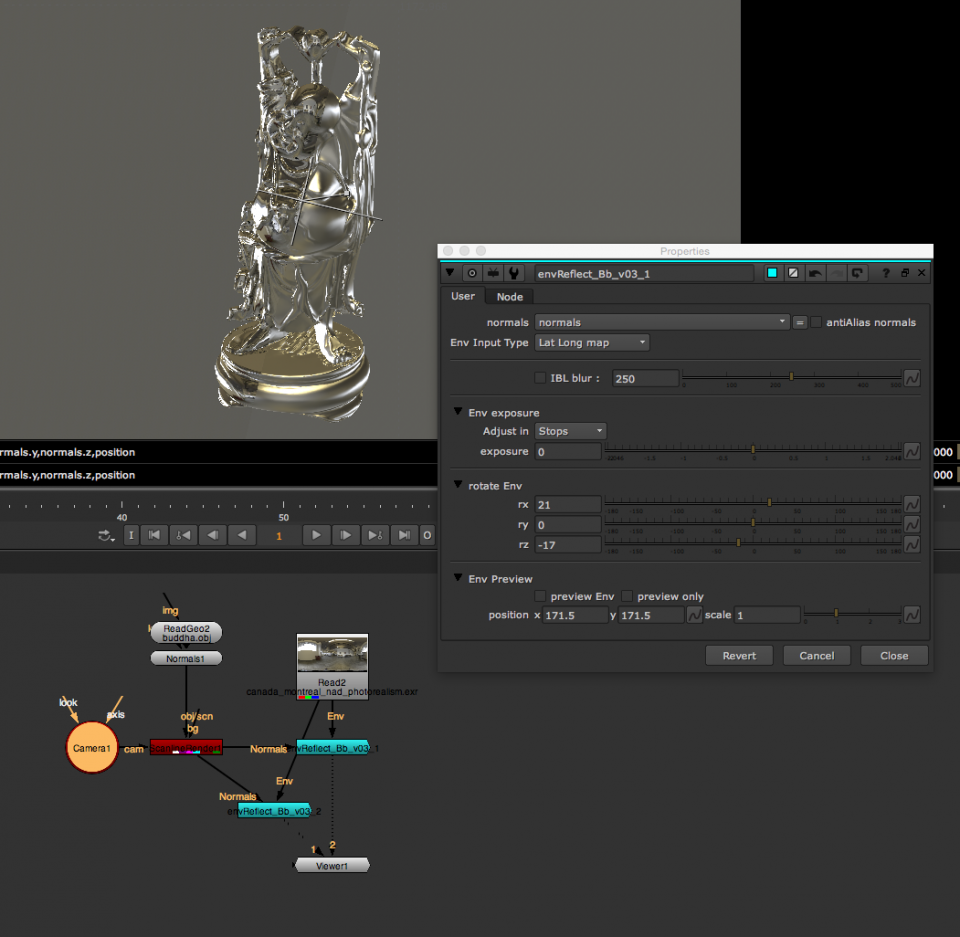

# EnvReflect_BB [NKPD]

**Author:** Bastian Brenot - [http://www.bastienbrenot.com/nuke-tools/](http://www.bastienbrenot.com/nuke-tools/)

- [http://www.nukepedia.com/gizmos/other/envreflect_bb_v03](http://www.nukepedia.com/gizmos/other/envreflect_bb_v03)

Fake Environment reflections on normals pass.

Feed it with a normals pass through the 'image' input, and select the right channel for it. Works better with cameraSpace Normals.
### Environment Map Types
- Mirror Ball
- Latlong Map
- Cube
- Angular map 180
- Angular map 360
- Sphere
- 180 degree fish eye lens
### Features
- Option to Blur the IBL
- Antialias normals to get rid of flickering
- Option to rotate the environment map in X, Y, Z
- Use Env Preview to preview the Envball with transformations
