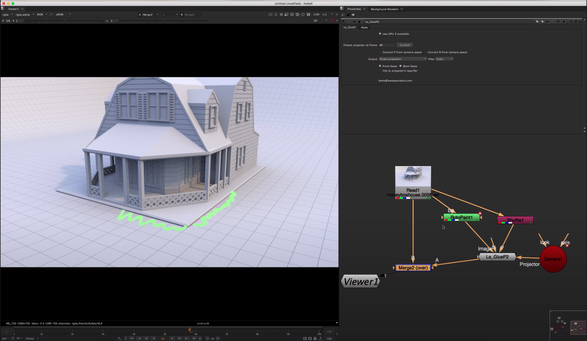

# GlueP [LS]

**Author:** Lewis Saunders - [http://lewissaunders.com/](http://lewissaunders.com/)

- [https://github.com/lcrs/blinks/](https://github.com/lcrs/blinks/)

GlueP glues an image to a position pass, by projecting on it, using BlinkScript.
### Inputs
- **Image to project**
- **P:** The position pass
- **N:** An optional normals pass for front/back facing selection
- **Projector:** The Camera to project from
- **CGCamera:** Optionally the original camera from the CG render
The second camera input can be used to convert P and N from camera space to world space - many renderers output camera space P and N by default, but we need world space to do this. Even better is a "world position at frame 1" or "P0" or "Rest position" pass, which sticks properly to the surface of animated meshes.
### Tips
A good way to check that a position pass is suitable to project on is to plug it into a PositionToPoints node along with the beauty pass and check in the 3D view that the points lie within the camera frustum and are laid out in space like the 3D scene was.

It works best with 32-bit float P and N passes, rather than 16-bit half.

