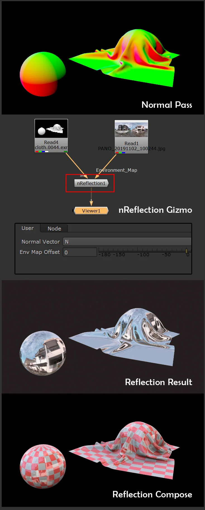

# N_Reflection [NKPD]

**Author:** Chetal Gazdar

- [https://www.nukepedia.com/gizmos/transform/nreflection](https://www.nukepedia.com/gizmos/transform/nreflection)

Through this Gizmo you can create fake reflection in post using only Normal pass.

Plug in your Normals pass, select normals channel, and rotate the environment map. LatLong HDRI's work best, but any image will work.
