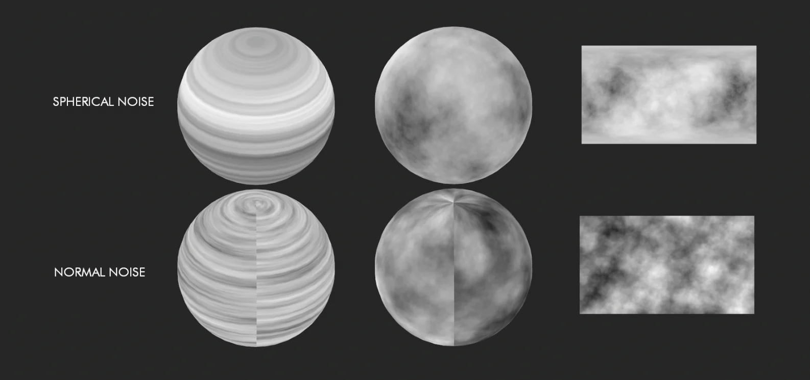

# Noise3D [SPIN]

**Author:** SPIN FX / Erwan Leroy - [http://erwanleroy.com/blog/](http://erwanleroy.com/blog/)

- [https://github.com/SpinVFX/spin_nuke_gizmos](https://github.com/SpinVFX/spin_nuke_gizmos)
- [http://www.nukepedia.com/gizmos/other/spin_nuke_gizmos-1](http://www.nukepedia.com/gizmos/other/spin_nuke_gizmos-1)
- [http://erwanleroy.com/spin-vfx-nuke-gizmos-2-0-released/](http://erwanleroy.com/spin-vfx-nuke-gizmos-2-0-released/)
- Video: [https://vimeo.com/381270956](https://vimeo.com/381270956)

Generate Noise in 3D space based on Position passes. It includes pre-made Position passes for some 3D primitives, or can use a custom Position pass. Uses a 4D noise internally so that the 4th dimension can be used to add a 'boiling' effect.

Choose between fBm and Turbulence.
### Mapping Options
- Card (Flat)
- Spherical
- Cylindrical (Tile X)
- Cylinder 4D (Tile X and Y)
- Custom P Input
The Custom P Input lets you input the shape of your choice. Using a pWorld pass as custom P will generate a 3D noise as seen from the same camera as used to render the Pworld. Ensure an Alpha channel is present for Custom P.

