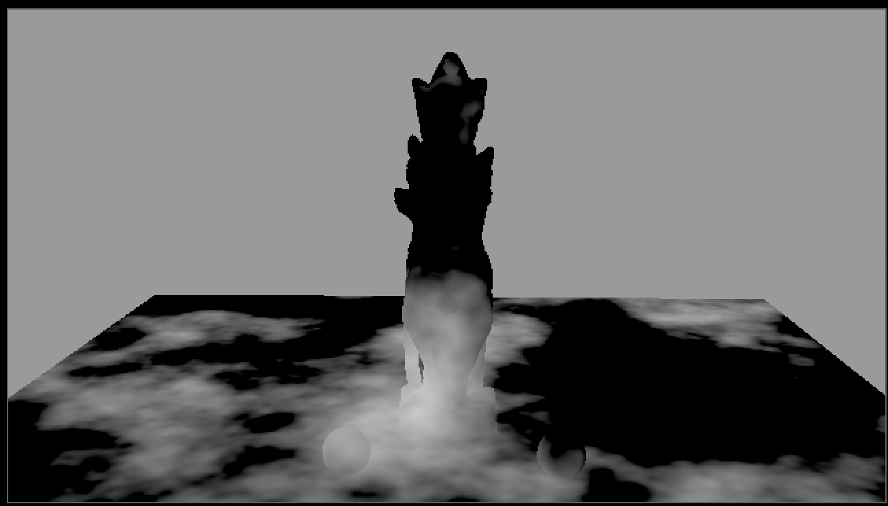

# Noise4D [MHD]

**Author:** Mads Hagbarth Damsbo - [https://hagbarth.net/blog/](https://hagbarth.net/blog/)

- [http://www.nukepedia.com/blink/draw/4d-noise](http://www.nukepedia.com/blink/draw/4d-noise)

This is a port of the 4D simplex noise found at https://github.com/Draradech/csworldgen/blob/master/simplexnoise.cpp
Blink script - 4D Noise Generator (Based on image values)
It uses the image values of the input image to generate the noise. It is not fast, but it does the job quite well.
### Input Channel Mapping
- Red, Green, Blue image (Pworld or Pref or vectors): X, Y, Z position
- Alpha Channel: Evolution (4th dimension) - change alpha to change the seed/evolution
