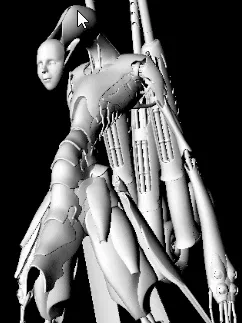
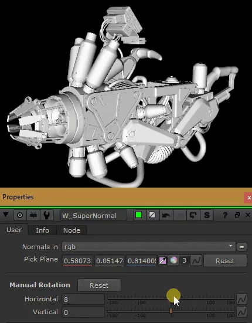
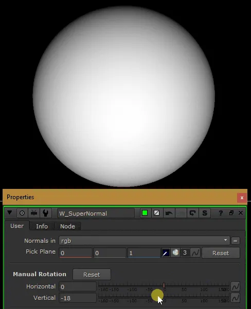

# NormalsRotate [NKPD]

**Author:** Wes Heo

- [http://www.nukepedia.com/gizmos/3d/w_supernormal](http://www.nukepedia.com/gizmos/3d/w_supernormal)

There are two ways to select the surface angle:
1. **P_Matte inspiration:** The colorpick method like P_Matte to do with normals what it does with position data
2. **Rotation sliders:** Horizontal and Vertical Rotations sliders
### Instructions
1. Select the layer containing normals in the dropdown menu
2. Enable color picker and pick the point where you want the matte to be white (look at the alpha output, hold ctrl+alt and "glide" over the surfaces)
3. You can also manually rotate the matte. When you colorpick a new point, it is recommended to reset the manual rotation values to 0
### Matte Output Options
- Invert output
- Mask by alpha
- Unpremult
Exponential falloff controls and post grade. Mask and mix controls added.

