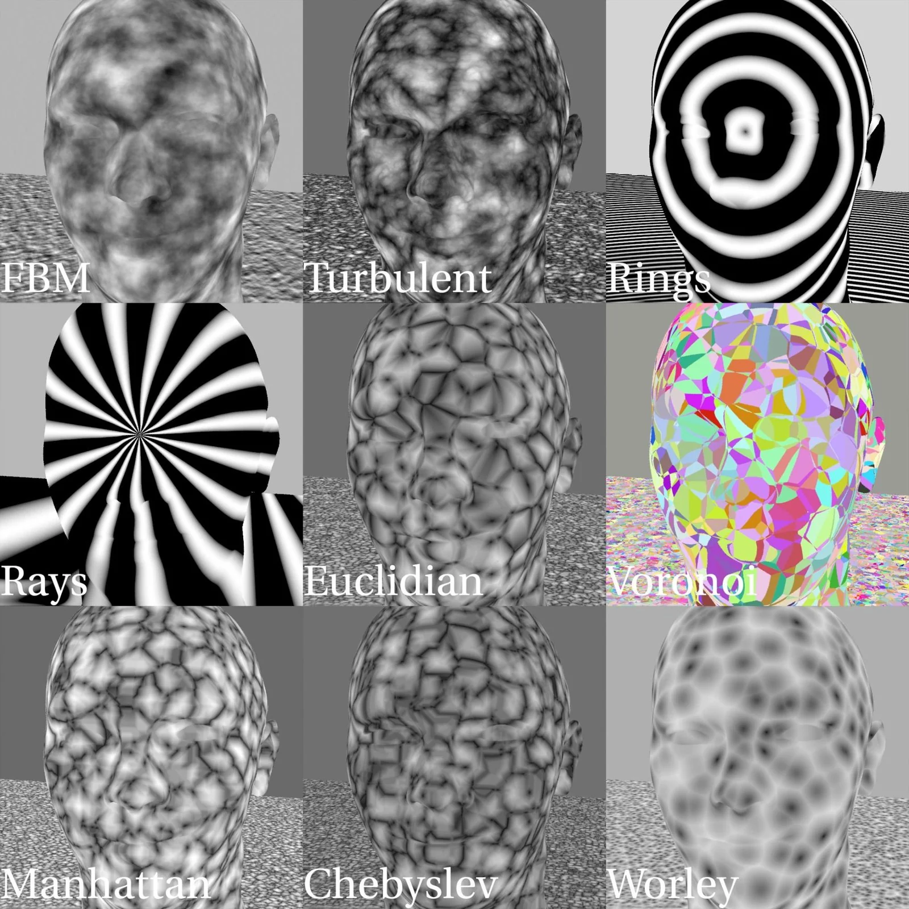

# P_NoiseAdvanced [NKPD]

**Author:** Riley Gray

- [http://www.nukepedia.com/blink/keyer/p_noise_advanced](http://www.nukepedia.com/blink/keyer/p_noise_advanced)

P_Noise_Advanced is a tool that allows you to apply various 3D noises and fractals to a rendered position pass such as world position or rest position.
### Noise Types
- Euclidian
- Voronoi
- Manhattan
- Chebyslev
- Worley
Each noise type has their own knobs and controls specific to each one.
### Features
- A 2D position knob can be used to sample a center point in real time
- Adrian Pueyo's 'c44kernal' allows you to transform the noise however you wish in 3D space
- The Blink written noise types (Euclidian, Voronoi, Manhattan, Chebyslev and Worley) are based on Matthew Shaw's 'Cell Noise' and adapted to work on a position pass
- The other noise types are written in TCL using Nuke's expression node
