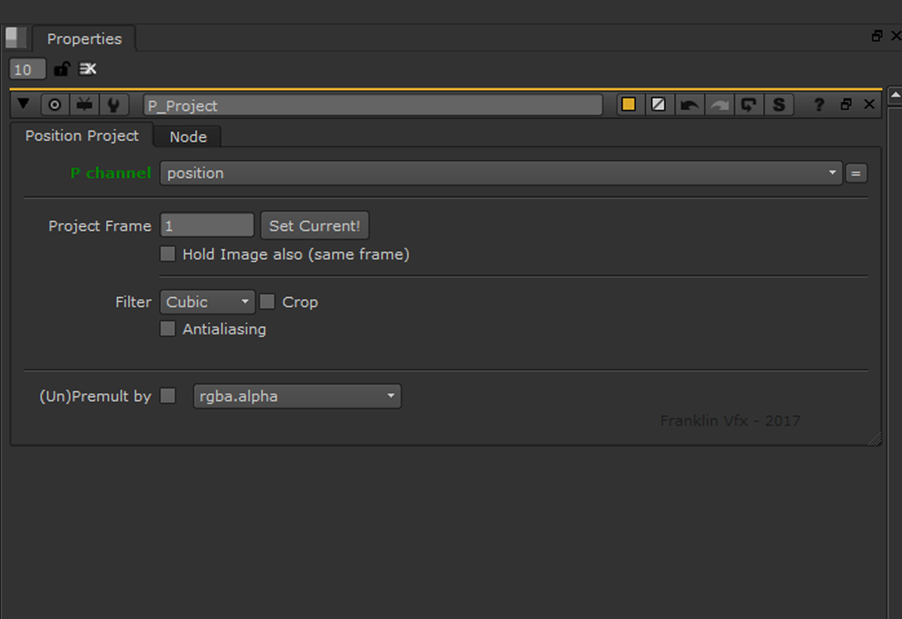
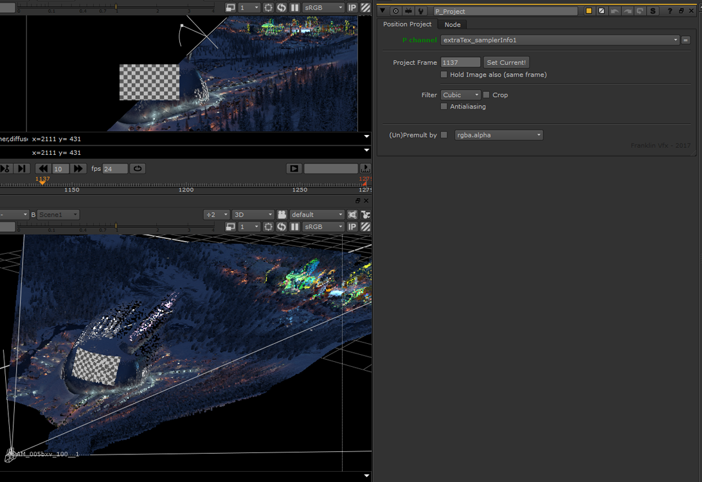

# P_Project [NKPD]

**Author:** Franklin Toussaint - [http://franklinvfx.com/tools-2/](http://franklinvfx.com/tools-2/)

- [http://franklinvfx.com/pos_project/](http://franklinvfx.com/pos_project/)
- [https://github.com/franklinvfx/Position_Project-Tool-for-Nuke](https://github.com/franklinvfx/Position_Project-Tool-for-Nuke)

Camera projection using the render of "World Position" and camera.

The most important advantage of this one is that it's a very light tool (you don't need to import in Nuke a heavy mesh).

So it's fast and easy to use, but still has to have the position pass and the 3D camera.
### Tool Details
- **P Channel:** Select the Position Pass channel
- **Project Frame:** Select the reference frame (hold the camera who does the projection)
- **Hold Image:** Frame hold the input image at the same frame as the camera
- **Crop:** Project or not outside of the format area
- **Antialiasing:** Reduce the edges aliasing problems
- **(Un)Premult:** Keep nice shapes on edges

