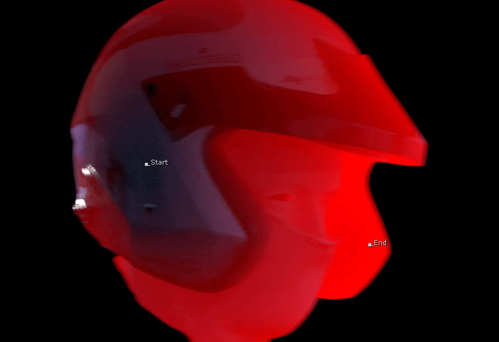
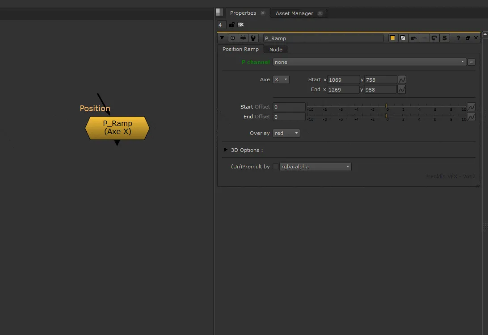

# P_Ramp [NKPD]

**Author:** Franklin Toussaint - [http://franklinvfx.com/tools-2/](http://franklinvfx.com/tools-2/)

- [http://franklinvfx.com/pos_ramp/](http://franklinvfx.com/pos_ramp/)
- [https://github.com/franklinvfx/Position_Ramp-Tool-for-Nuke](https://github.com/franklinvfx/Position_Ramp-Tool-for-Nuke)

Quickly create a ramp using the data contained in the render of "World Position" or "Ref Position".

This node has several advantages. The position of the ramp is not set by a "color picker" but with a 2D Position knob which executes callbacks. So it is possible to precisely place the ramp regardless of the channel viewed.

With the "Overlay" mode, the tool is visually even more convenient. Visualization in 3D space is also a real advantage in certain situations, as well as the integration of the "Unpremult" and "Premult" which makes it possible to obtain clean edges.
### Tool Details
- **P Channel:** Select the Position Pass channel
- **Axe:** Choose the ramp direction (X, Y, or Z)
- **Start & End:** Adjust the position of the two extremes of the ramp
- **Offset (Start & End):** Precisely adjust the position between the two extremes with a slider
- **Overlay:** Show the ramp on overlay (looking at the RGB) and change the color (none, red, green, blue, or black)
### 3D Options
- Visualize in 3D the input image and the ramp using a "position to point" node
- Adjust the "Point Detail" and the "Point Size"
- Adjust the size of 3D points representing the position of the two extremes
### Other Options
- **(Un)Premult:** Keep nice shapes on edges

