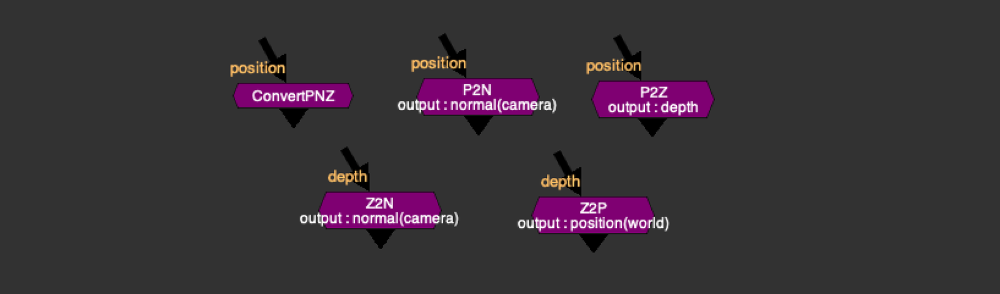
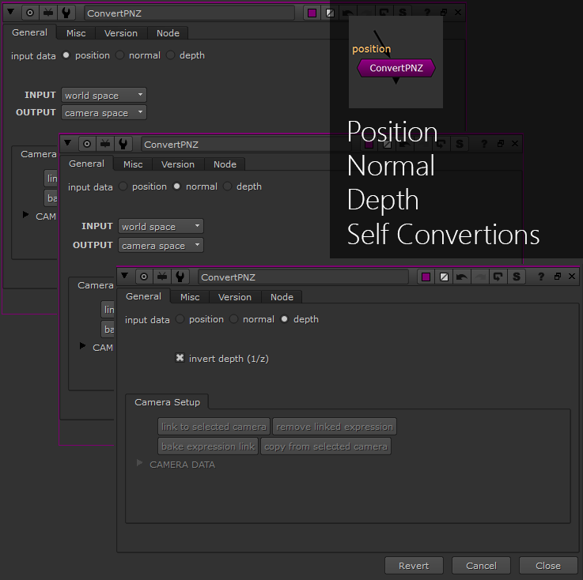
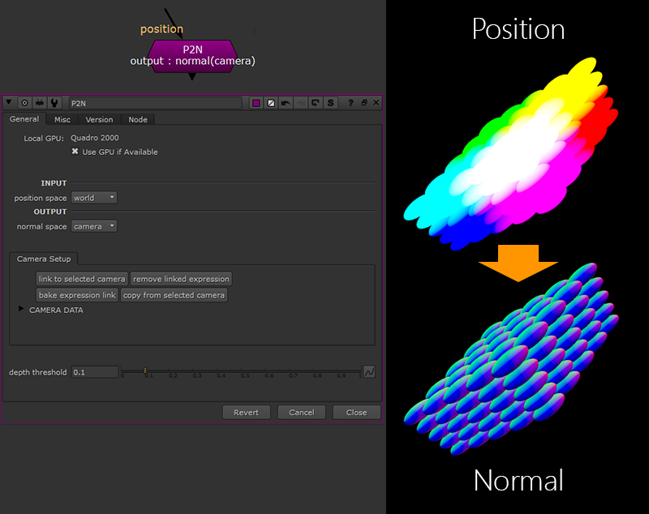
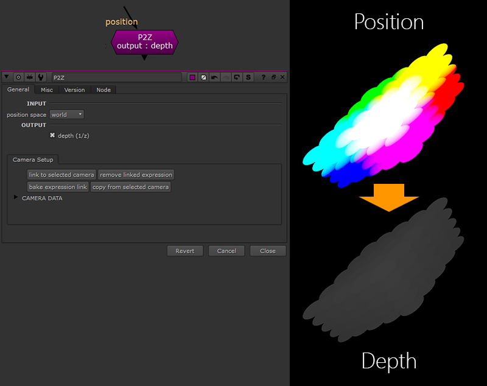
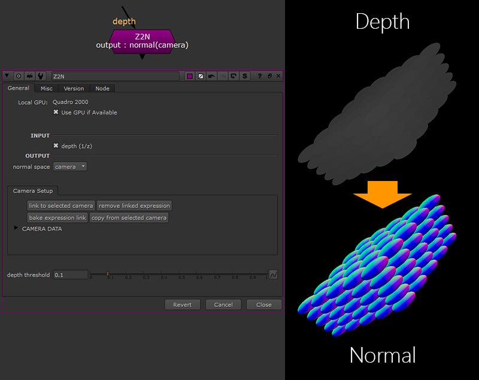

# PNZ Suite [MJT]

**Author:** Mark Joey Tang - [http://www.facebook.com/MJTlab](http://www.facebook.com/MJTlab)

- [http://www.nukepedia.com/blink/draw/positiontonormal](http://www.nukepedia.com/blink/draw/positiontonormal)

Convert 3D data passes. This suite includes tools for converting between Position, Normals, and Depth data. Created as a standalone version for 2D comp with added conversion options for 2.5D comp.

Convert Position/Depth to Normal may have a little bit of artifact on edges. Try to adjust 'Depth Threshold' for better results. It might not be able to get decent results on thin objects, such as hair/fur.

If you use it for relight, try to light it with this pass first - those artifacts might not be an issue.

Some space swaps require camera data.
---

