# Pos Toolkit [MJT]

**Author:** Mark Joey Tang - [http://www.facebook.com/MJTlab](http://www.facebook.com/MJTlab)

- [http://www.nukepedia.com/toolsets/3d/pos-toolkit](http://www.nukepedia.com/toolsets/3d/pos-toolkit)
- Demo Video / ToolGuide: [https://youtu.be/0K3Inzt00lE](https://youtu.be/0K3Inzt00lE)
- v1.2 update: [https://youtu.be/n2TvdA-fElI](https://youtu.be/n2TvdA-fElI)

This position toolkit is based on Deep2VP to create and work in 2D compositing instead of Deep. The toolset has PosMatte, PosPattern and PosProjection, the function and workflow is the same as DVPMatte, DVPattern and DVProjection in Deep2VP.

Input of all these nodes must contain world space position data and alpha. If you need to convert position from camera space, use the PNZ Suite to do the job.
---

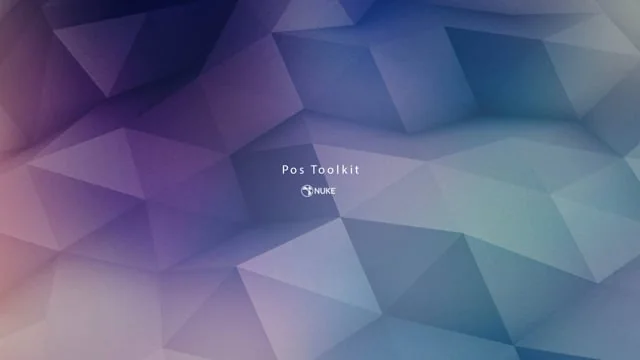

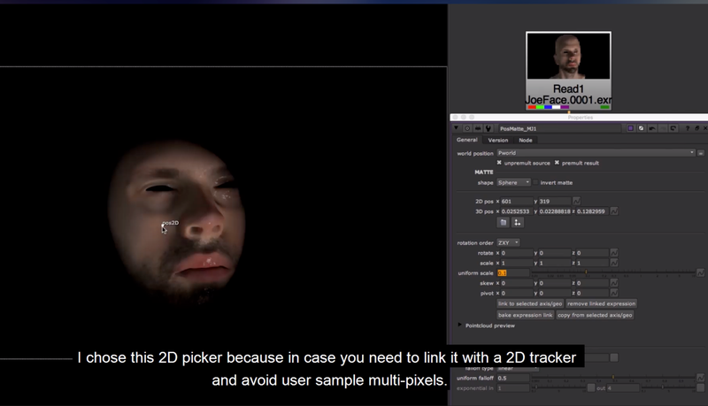

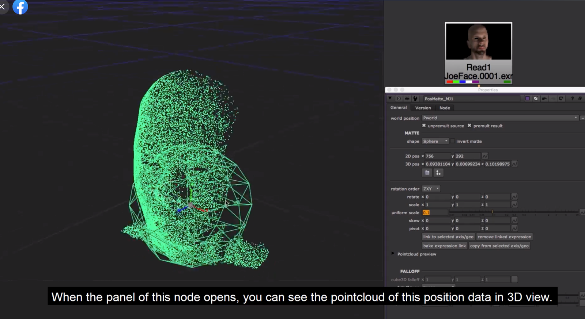

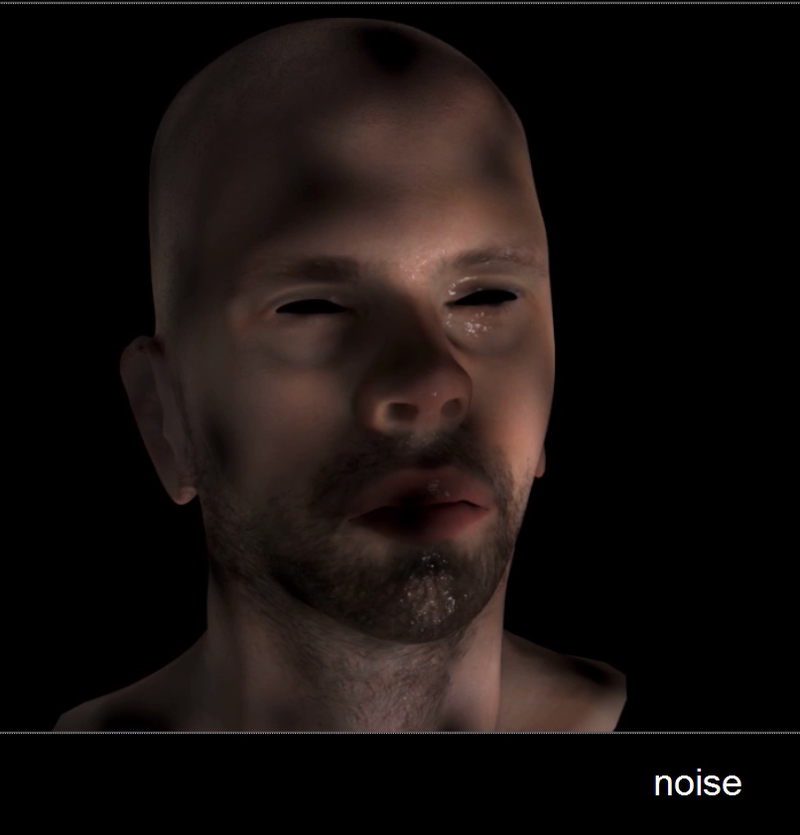

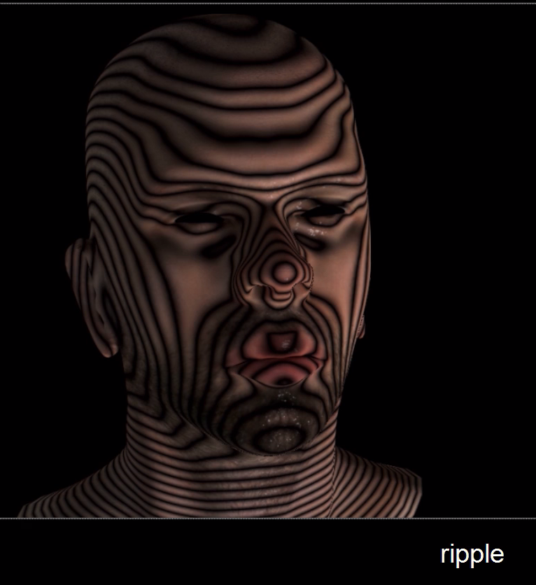

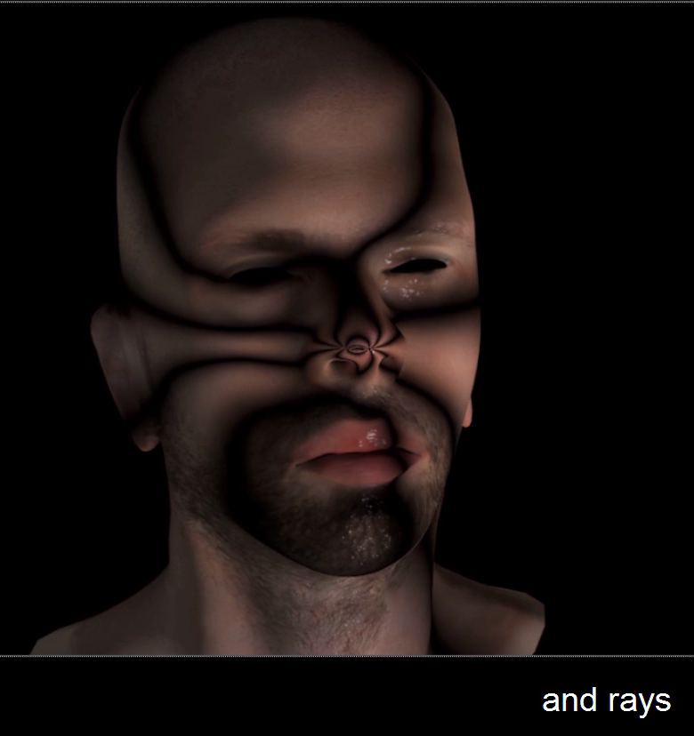

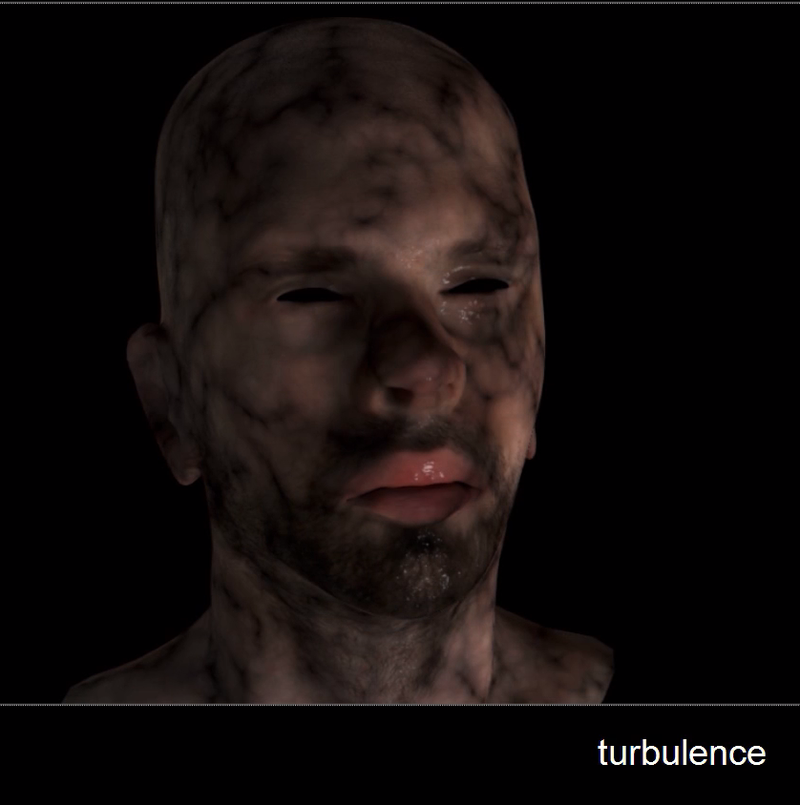

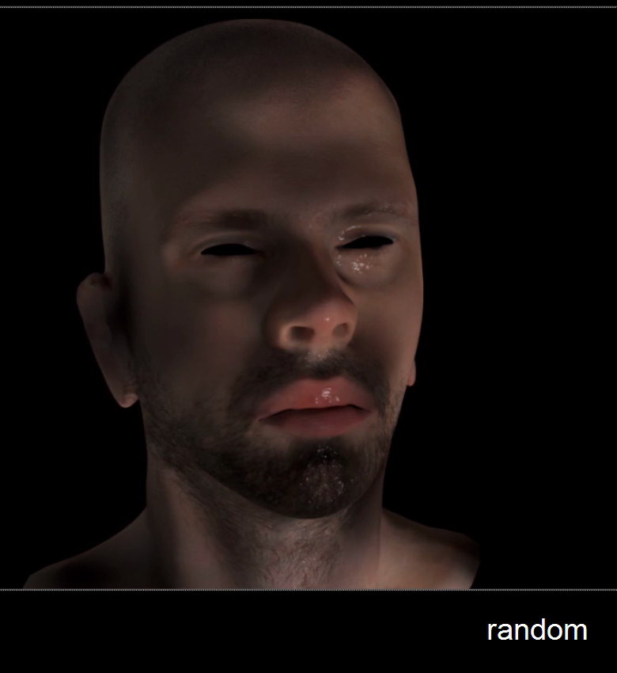

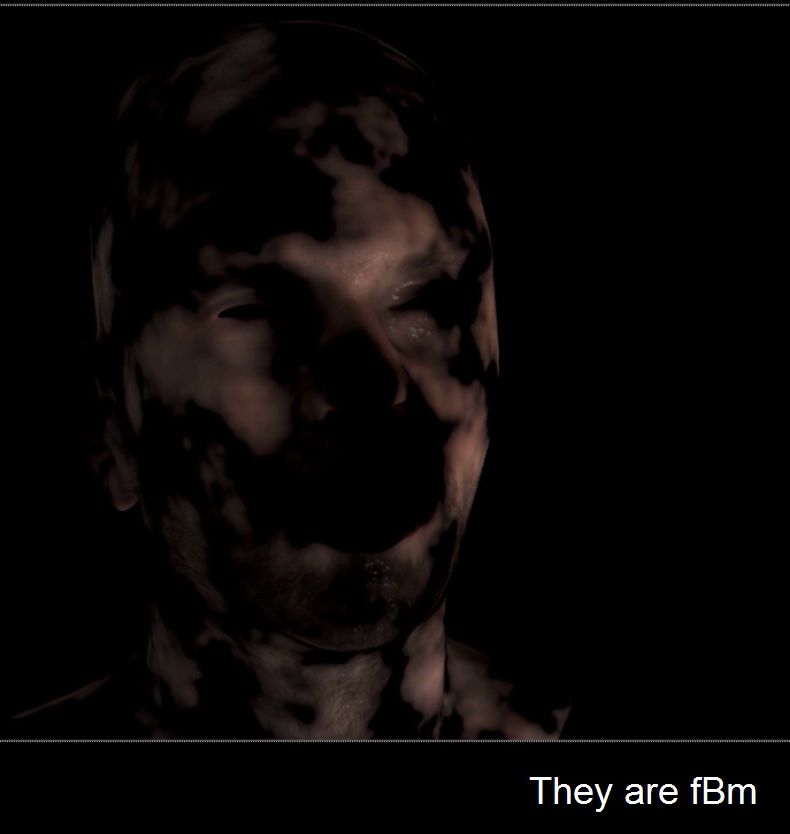

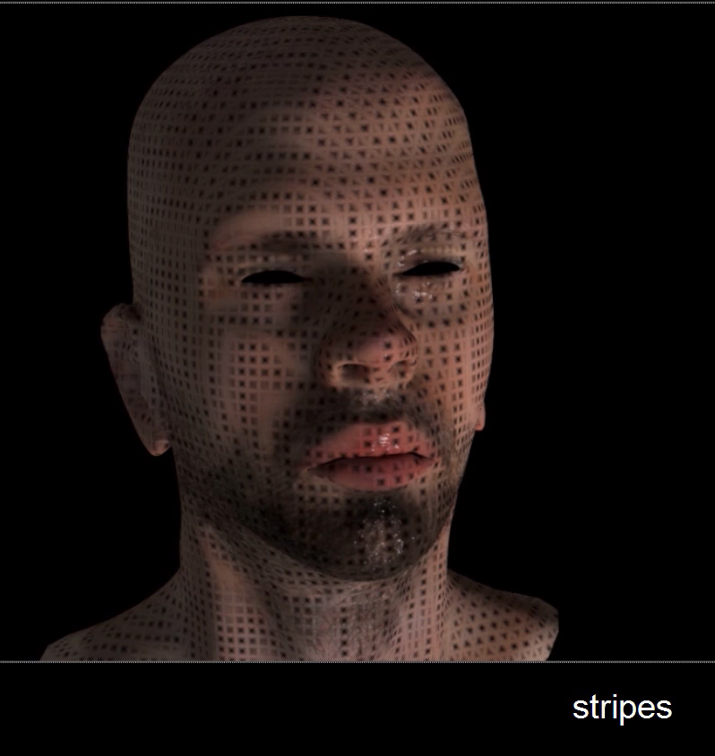

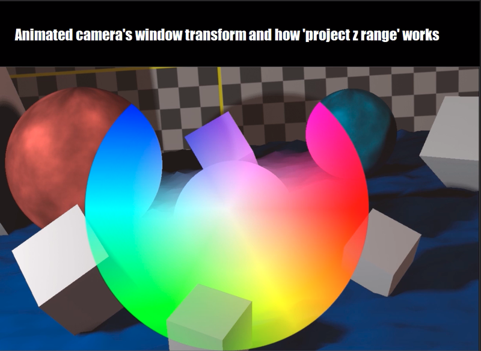

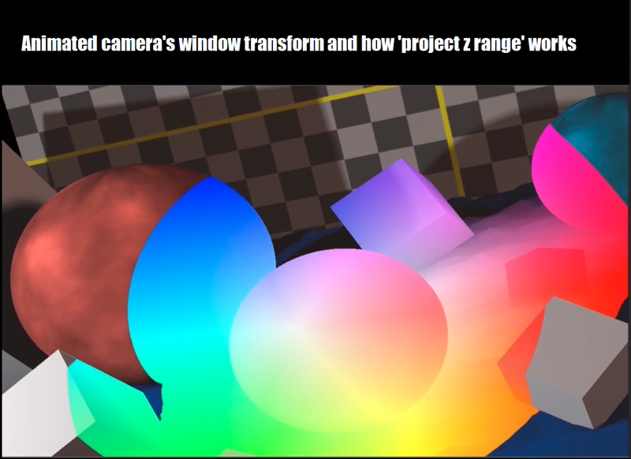
