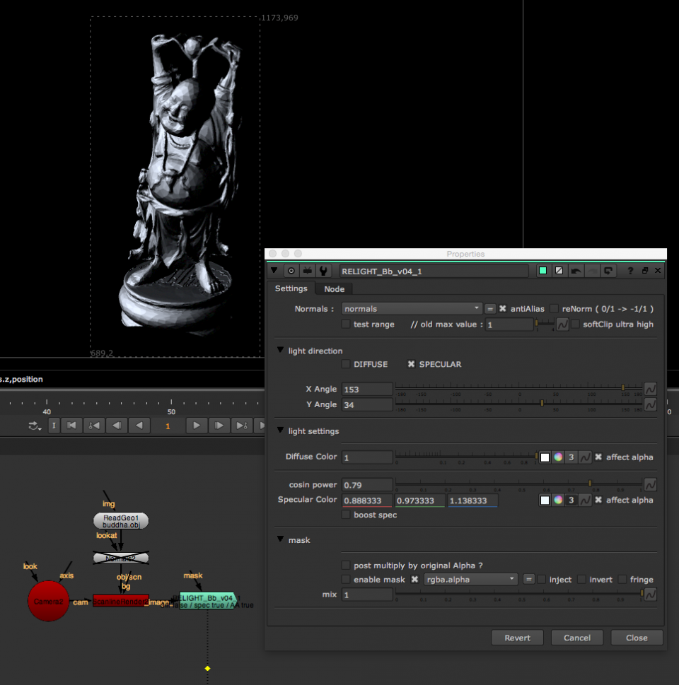

# Relight_BB [NKPD]

**Author:** Bastian Brenot - [http://www.bastienbrenot.com/nuke-tools/](http://www.bastienbrenot.com/nuke-tools/)

- [http://www.nukepedia.com/gizmos/other/relight_bb_v04](http://www.nukepedia.com/gizmos/other/relight_bb_v04)

A 2D based Relighting tool to help relight 3D renders with help of a normals pass.

All you need is to feed it with a normals pass through the Normals input.

Use the 'mask' input to isolate a specific object in your scene.
### Features
- Antialias normals to get rid of flickering
- Use ReNorm if your normals are coded from 0 to 1 instead of -1 to 1
