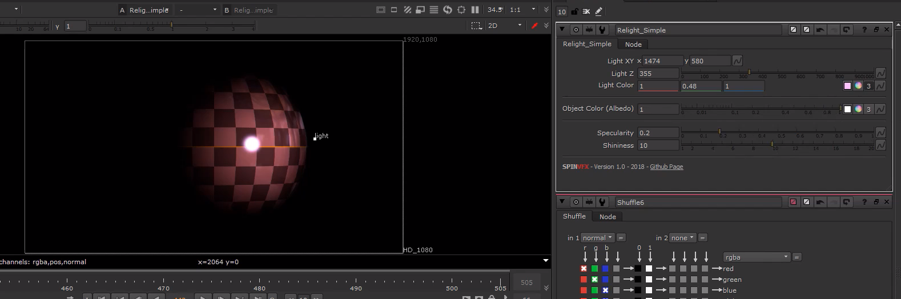

# Relight_Simple [SPIN]

**Author:** SPIN FX / Erwan Leroy - [http://erwanleroy.com/blog/](http://erwanleroy.com/blog/)

- [https://github.com/SpinVFX/spin_nuke_gizmos](https://github.com/SpinVFX/spin_nuke_gizmos)
- [http://www.nukepedia.com/gizmos/other/spin_nuke_gizmos-1](http://www.nukepedia.com/gizmos/other/spin_nuke_gizmos-1)
- [http://erwanleroy.com/spin-vfx-nuke-gizmos-2-0-released/](http://erwanleroy.com/spin-vfx-nuke-gizmos-2-0-released/)
- Video: [https://vimeo.com/381270956](https://vimeo.com/381270956)

Simplified relight node. Only requires a normal map to get started.

This node will not reproduce accurate lighting, as it does not take into account the actual 3D world space, but instead considers the image in its own local space.
### How to Use
1. Plug Normals input to a Normals Pass that is shuffled into RGBA
2. Choose a 2D position to orient the relighting angle
3. Light Z attempts to set a distance of the picker, forward or backwards in 'Z space'
4. Choose light color
5. Option to use an albedo pass (aka a texture or color pass) as an input
6. Specularity and shininess options available

