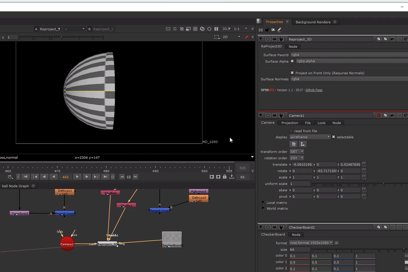
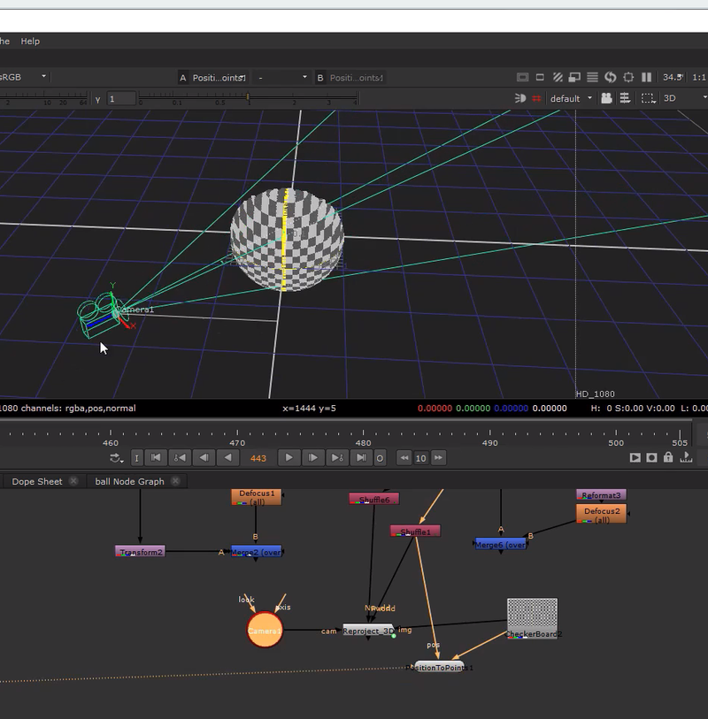

# Reproject3D [SPIN]

**Author:** SPIN FX / Erwan Leroy - [http://erwanleroy.com/blog/](http://erwanleroy.com/blog/)

- [https://github.com/SpinVFX/spin_nuke_gizmos](https://github.com/SpinVFX/spin_nuke_gizmos)
- [http://www.nukepedia.com/gizmos/other/spin_nuke_gizmos-1](http://www.nukepedia.com/gizmos/other/spin_nuke_gizmos-1)
- [http://erwanleroy.com/spin-vfx-nuke-gizmos-2-0-released/](http://erwanleroy.com/spin-vfx-nuke-gizmos-2-0-released/)
- Video: [https://vimeo.com/381270956](https://vimeo.com/381270956)

This gizmo does camera projection using a render point position pass (in world space) and a 3D camera to remap all the layers in the input image.

**NOTE:** The projection works best with unmatted input images or at least unpremulted matting with some coverage, then all masking occurs within the gizmo.
### Masking Options
- Input alpha from the 3D render
- Projecting on surfaces facing camera, using normal (N) in world space

