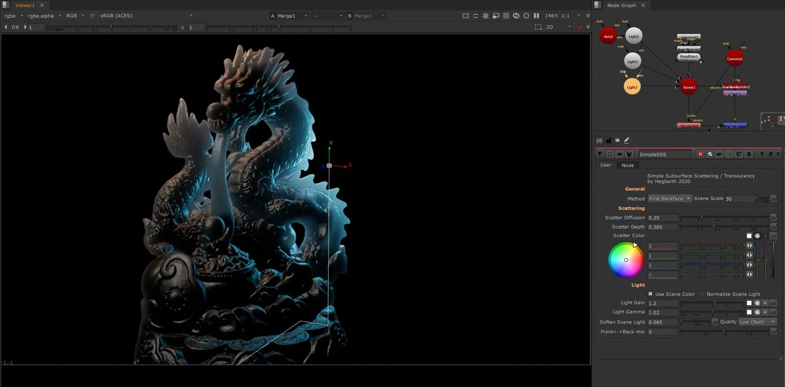
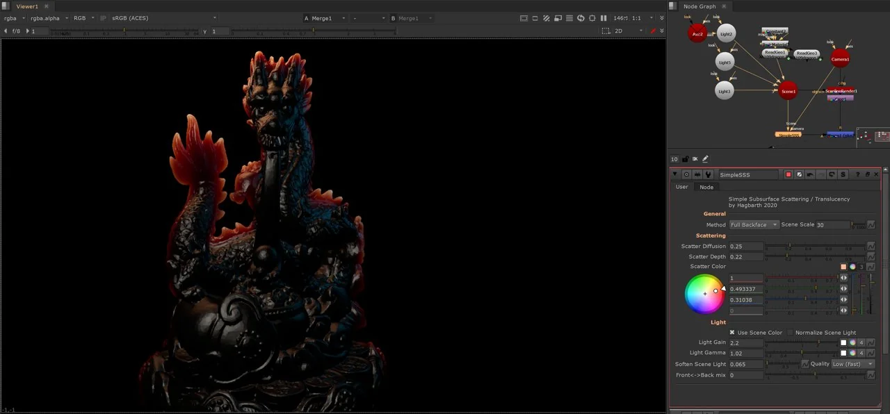
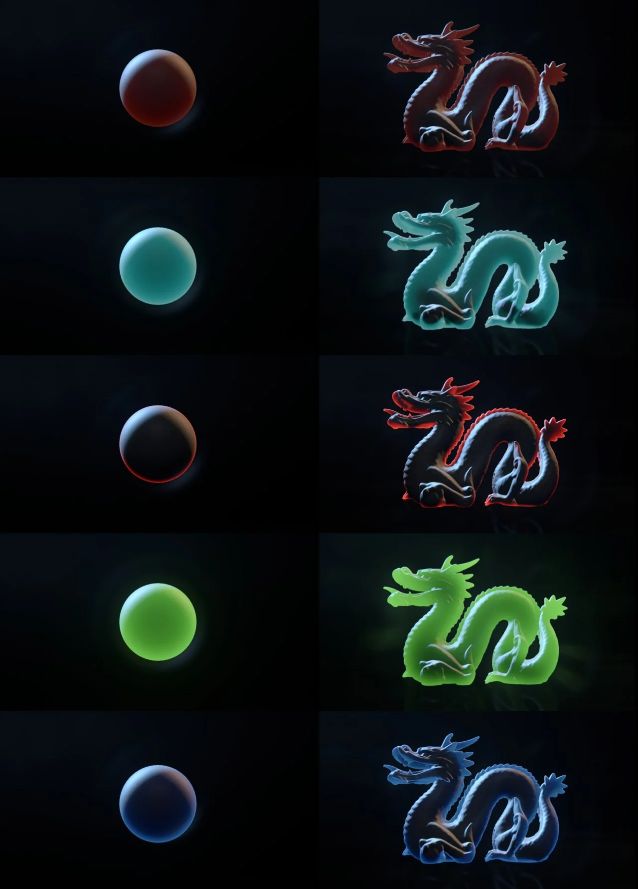

# SimpleSSS [MHD]

**Author:** Mads Hagbarth Damsbo - [https://hagbarth.net/blog/](https://hagbarth.net/blog/)

- [http://www.nukepedia.com/gizmos/3d/simple-subsurface-scattering](http://www.nukepedia.com/gizmos/3d/simple-subsurface-scattering)
- [http://www.hagbarth.net/translucency-shader-in-nuke/](http://www.hagbarth.net/translucency-shader-in-nuke/)

SimpleSSS tool lets you create a simple, stylized faux SSS/translucency effect on your Nuke Geo.

Simply apply this node, input your model and a camera, and plus the output of the node over your normal scanline render.

