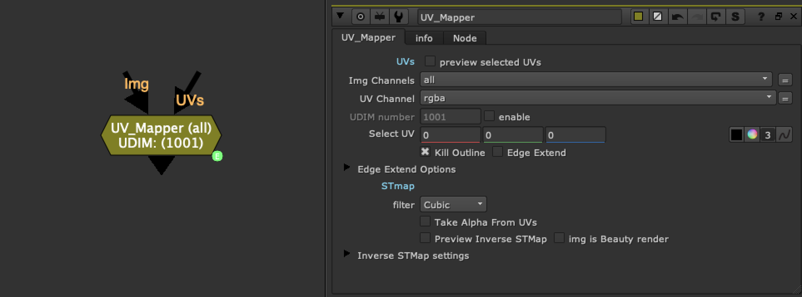
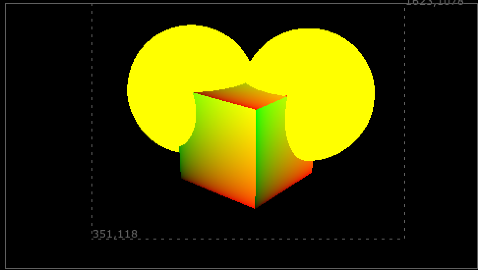
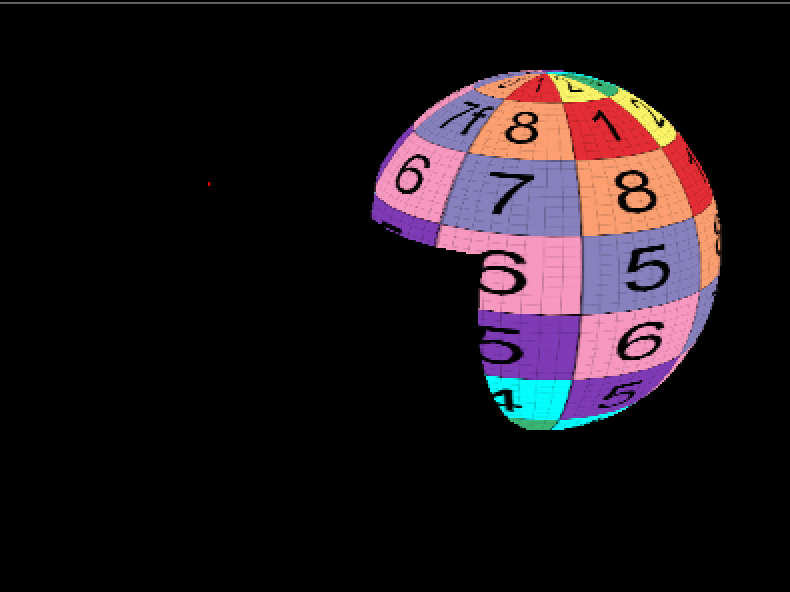
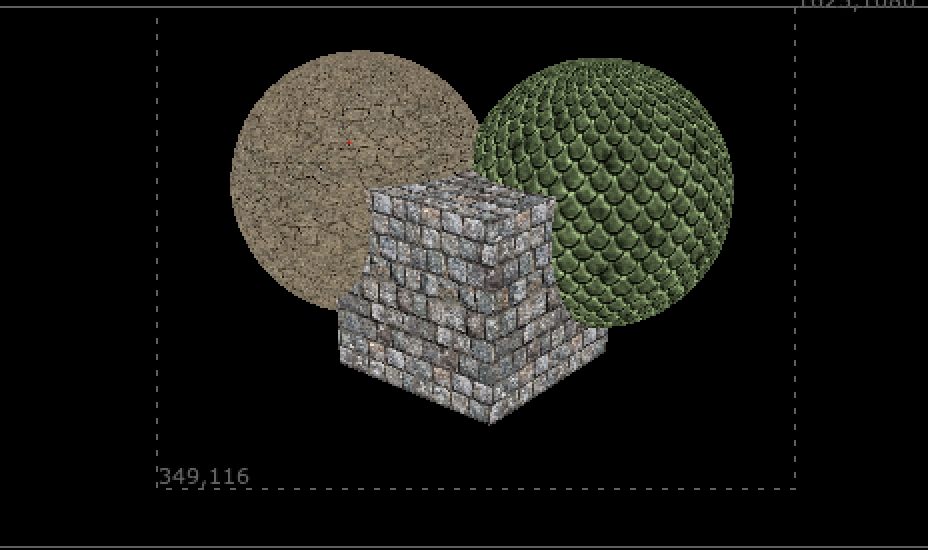
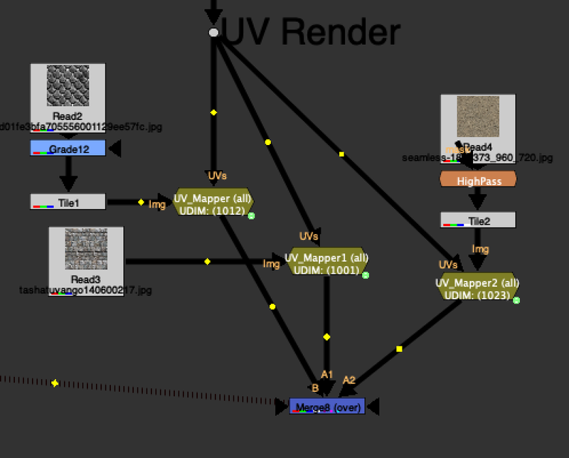
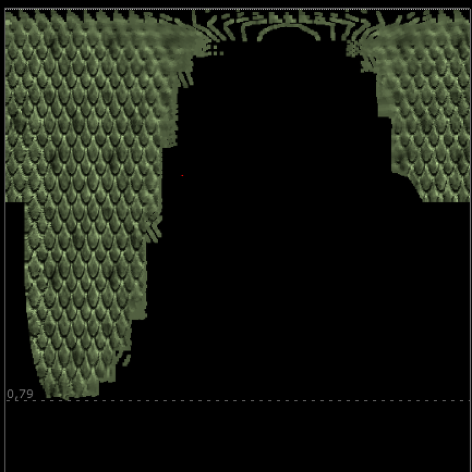

# UV_Mapper [TL]

**Author:** Tony Lyons - [http://www.CompositingMentor.com](http://www.CompositingMentor.com)

UV_Mapper is for mapping textures on a UV pass with multiple UDIMs in the render. Sometimes for creature or other assets, the CG department breaks up the texture passes into multiple UDIMs. This means there are multiple UV sections in the render. Frequently they render this UV pass with each UDIM offset by 1. So you would have 0.5, 1.5, 2.5 for UDIM 1001, 1002, 1003 for example.
### How to Use
1. Plug your UV pass render into the UV_Mapper in the UVs input
2. Use the select UV color picker to isolate which of the UDIM UVs you'd like to use
3. By default, when there is no image plugged into the img input, there is a UV grid preview as a placeholder for you to see which UDIM you have selected
4. Once you plug an image into the img input, it will replace this placeholder
You can create multiple UV_Mappers and grab a few textures, and with a simple setup you can retexture parts of your image.
### Features
- **Kill outline:** Erodes in a bit to handle anti-aliased UV passes
- **Edge extend option:** Push some UV color value to reduce artifacting
- **Take alpha from UVs:** Use the alpha from the input image, remapped in UV space, instead of the CG render alpha
- **Preview STMap:** See what part of UV space the texture occupies when "unwrapped"
- **Img is beauty render:** Isolate the area of the beauty render where the UDIM is selected and unwrap in UV space
*Thanks to Luca Mignardi and his inverseSTMap gizmo for the STMap preview functionality.*

