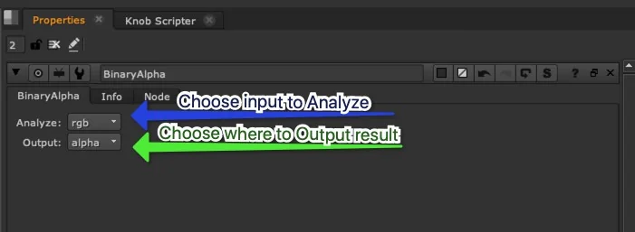
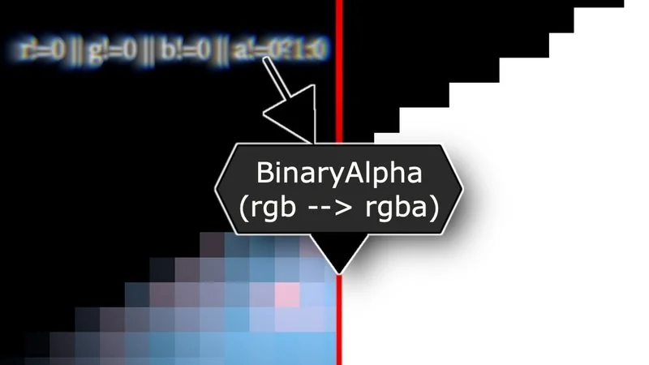

# BinaryAlpha TL

**Author:** Tony Lyons - [https://www.CompositingMentor.com](https://www.CompositingMentor.com)

- [http://www.nukepedia.com/gizmos/channel/binaryalpha](http://www.nukepedia.com/gizmos/channel/binaryalpha)

Analyzes a choice of the RGB, RGBA, or Alpha input and outputs an Alpha Channel (or RGBA) that is Binary, 0 or 1. Any Pixels that are not 0 will be turned into 1 (negative numbers also), and 0 will remain 0. This is perfect for those blur + unpremult tricks or if you need a quick matte for finding any rgb color above or below 0, in a CG render passes for example.
**Tcl expression:**
```
r!=0 || g!=0 || b!=0 || a! = 0 ? 1 : 0
```




