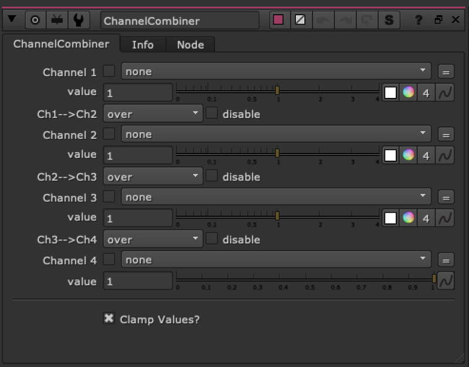

# ChannelCombiner TL

**Author:** Tony Lyons - [https://www.CompositingMentor.com](https://www.CompositingMentor.com)

Quickly combine 4 channels with an operation between each of them. Works best with ID mattes or roto's that are injected into a single stream. The channels dropdown lists every channel in the stream, so the best workflow would be to have a "mattes Stream" or "ID stream" with all the matte/roto/ID channels copied into an empty stream (no other channels)
Then you can use this node to make quick combinations:
Helmet.red plus Visor.red minus Antenna.red, for example
