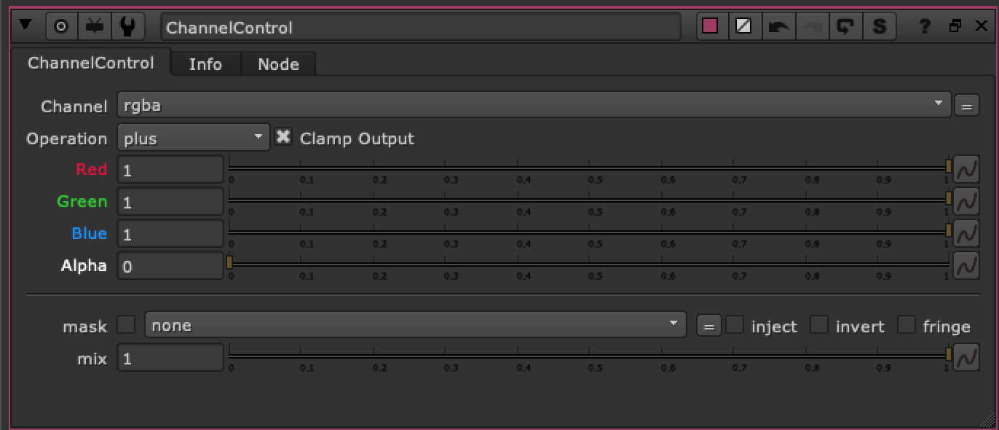

# ChannelControl TL

**Author:** Tony Lyons - [https://www.CompositingMentor.com](https://www.CompositingMentor.com)

Mix the ratio of Red, Green, Blue, Alpha Channels and choose a Merge operation.

Result is a black and white matte output into RGBA. Mask and mix options available.
