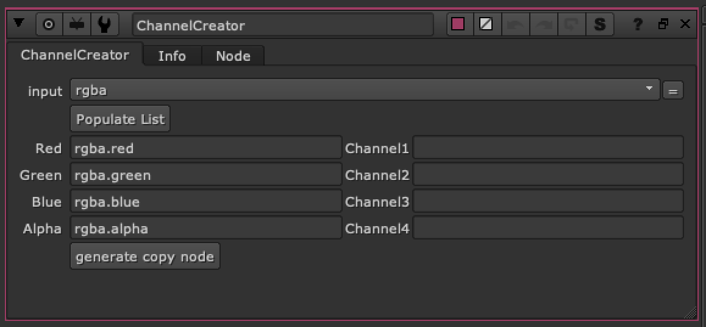

# ChannelCreator TL

**Author:** Tony Lyons - [https://www.CompositingMentor.com](https://www.CompositingMentor.com)



This tool is meant to be used with ID's or mattes that are in the RGBA layer. Create new names for the channel you wish to copy over and this node will create a copy node that converts rgba.red rgba.green, rgba.blue, and rgba.alpha over to new channels. Just enter a name in the right side column and the suffix will be <string>.red
Use this to quickly transfer and rename channels into a new "channel" stream in nuke that are uniquely named and can be identified and pulled out later to be used when compositing. Good for roto shapes or ID's when CG compositing.
### Example:
```
rgba.red    --> hat          =    hat.red
rgba.green --> glasses   =    glasses.red
rgba.blue  --> shoes      =    shoes.red
rgba.alpha --> jacket     =     jacket.red
```
Generate copy node will generate a copy node as follows:
```
rgba.red    --> hat.red
rgba.green --> glasses.red
rgba.blue  --> shoes.red
rgba.alpha --> jacket.red
```
Any fields left blank will not copy over in the generated copy node.
