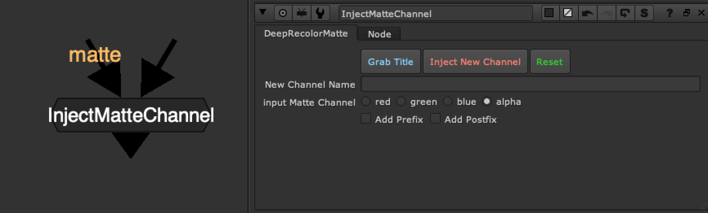

# InjectMatteChannel TL

**Author:** Tony Lyons - [https://www.CompositingMentor.com](https://www.CompositingMentor.com)

Takes a matte input and injects it into the stream as a new channel, using the "New Channel Name text input" and adding '.red' to the end, creating a new <channelName>.red channel.

A couple of buttons for ease of use, but 'grab title' requires adrian pueyo's stamps installed to work properly because it is running a function from his code.

### Features:

**Grab Title:** Will try and grab either the nearest stamp name, from the matte stream, or else a read node name if it finds a read node. Hopefully if you are using a pipeline, and stamps, and have configured stamps to default to part of the name of a read node to use as the name (you can adjust this in the stamps_config.py file) then it will run the same function to find the 'right' name to use and fill in the "New Channel Name" text input.

**Inject New Channel:** This will generate a new channel based off the new channel name input text and the add prefix, add post fix text inputs. It will copy the selected channel from 'Input Matte Channel" into the stream

**Reset:** Set node to default (does not remove the channel from the script)

**New Channel Name:** Manually enter the new channel name, or try the Grab Title to autofill

**Input Matte Channel:** Choose which channel from the matte input with be copied as new channel

**Add Prefix, Add Postfix:** Click to reveal additional input text fields, where you can add a prefix, which will appear before the new channel name, with an underscore. ie. "ID_" or a postfix, which will add text after your new channel name, with an underscore. ie. "_DImatte"

### Workflow Example

Above is an example of InjectMatteChannel 'Grab Title' grabbing the name of the incoming stamp. This can speed up your workflow quite a bit if you are used to using stamps to move around AOVs and mattes, and parts of your script with an alpha that you might want to use as a matte.

To the Right is a small example of how you might use a channel workflow. I have roto'ed the eyes and mouth of Marcie, and used InjectMatteChannel to copy the alpha into a new channel 'EyesMouth".

This channel now exists in the stream as another 'layer' you can see it in your viewer channels, and later on you can shuffle out the channel and use it for masks, grain matte, DI mattes, etc
