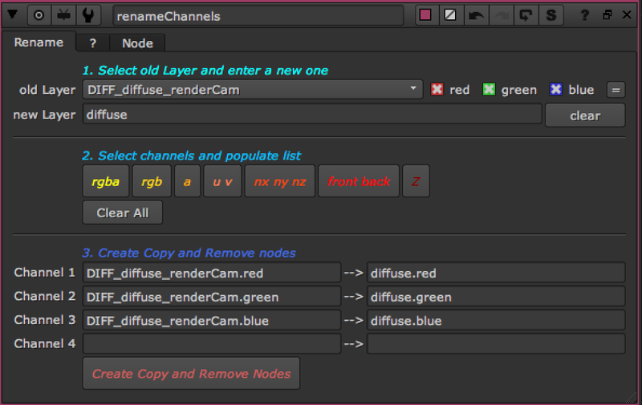
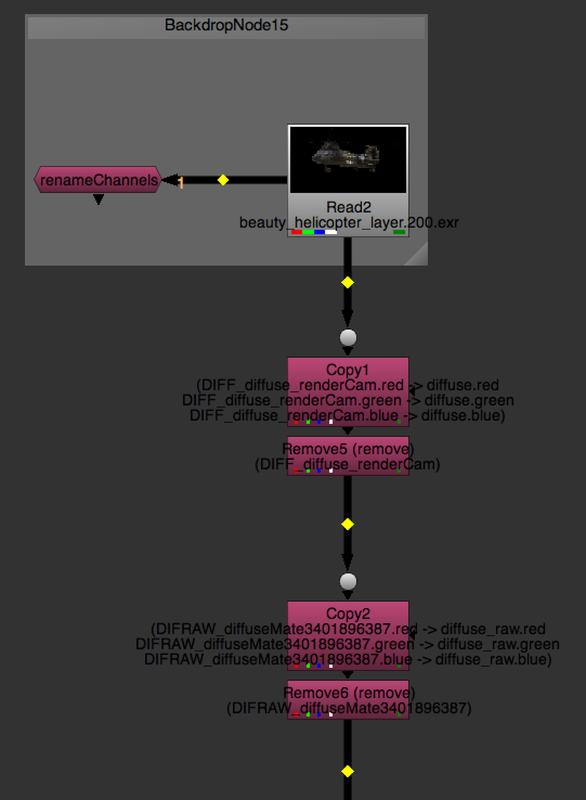

# RenameChannels AG

**Author:** Andrea Geremia - [http://www.andreageremia.it/tutorial.html](http://www.andreageremia.it/tutorial.html)

With this Gizmo you can rename Channels and Layers through Copy and Remove Nodes. In this way you have more control with the possibility to cancel the operation.
### Instructions:
1. Connect renameChannels node to your script.
2. Select the oldLayer and insert the name of the newLayer. Basically you want to rename the old name with the new one.
3. Select the Channels you want to create. They depend from the oldLayer
4. Click on button "Create Copy and Remove Nodes"
5. Connect the nodes created to your script.

