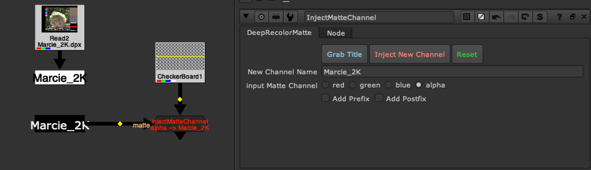

# StreamCart MJT

**Author:** Mark Joey Tang - [https://www.facebook.com/MJTlab](https://www.facebook.com/MJTlab)

- [https://www.nukepedia.com/gizmos/channel/streamcart](https://www.nukepedia.com/gizmos/channel/streamcart)
- [http://bit.ly/menupy](http://bit.ly/menupy)
- Video: [https://vimeo.com/367649727](https://vimeo.com/367649727)

Select channel or geo and quickly shuffle it.
### How to use (channel shuffle):
- Connect streamCart node to anywhere of the tree.
- Click 'get channels / geo'. It will scan through available channels from upstream
- Click the channels to create shuffle node
### How to use (Geo select):
- Connect streamCart node directly to 'ReadGeo'
- Click 'get channels / geo'. It will scan through avaliable geo mesh from upstream 'scene_view'
- Select all the individual objects
- Click 'ReadGeo Checkout' to create a new ReadGeo with the selection.

