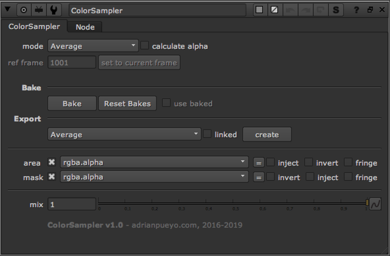
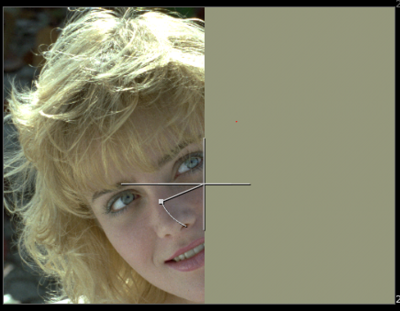

# apColorSampler AP

**Author:** Adrian Pueyo - [http://www.adrianpueyo.com/](http://www.adrianpueyo.com/)

- [http://www.nukepedia.com/blink/colour/colorsampler](http://www.nukepedia.com/blink/colour/colorsampler)
- Video: [https://vimeo.com/338472778](https://vimeo.com/338472778)

apColorSampler is a tool that calculates the average color of a target input (or the src image if there's no target input), weighted through the area input (or the whole frame if there's no area input). It can also calculate the maximum or minimum value over the area. Additionally, you can directly remove color flickering to an image, or apply it from a target.

You can think of ColorSampler as a live version of CurveTool with some additional features using the power of Blinkscript, where instead of being limited to a rectangle you can plug a roto to use for the sampling area... or a key... :)
Bake options available for framerange.

