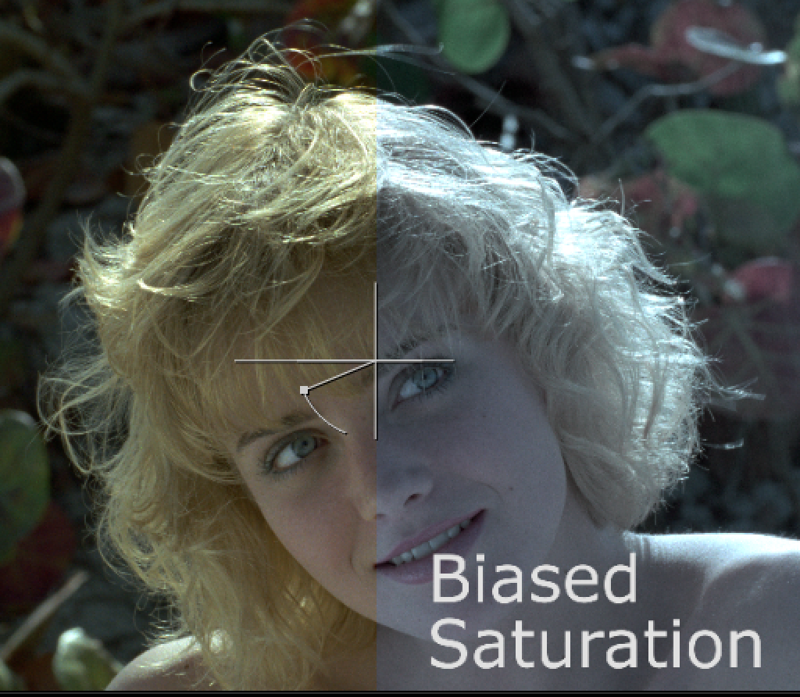

# BiasedSaturation NKPD

**Author:** Paul Raeburn

- [http://www.nukepedia.com/gizmos/colour/biasedsaturation](http://www.nukepedia.com/gizmos/colour/biasedsaturation)

Simple tool for changing the saturation but toward a picked colour.
**Changes by Tony Lyons:**
- Added channels dropdown and restore luminance slider
- Default set to a bluish color and saturation and mix sliders set to 0.5
