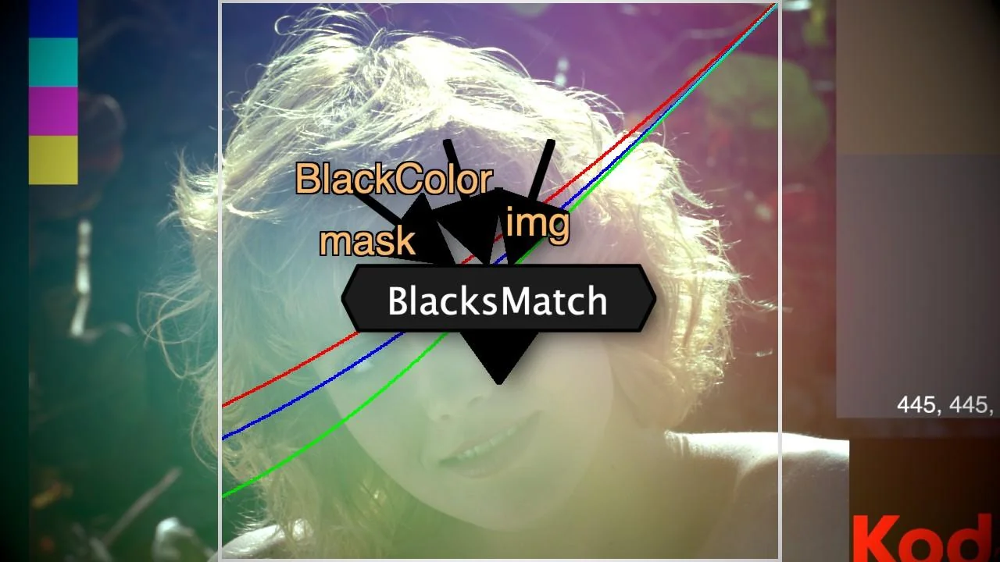

# BlacksMatch TL

**Author:** Tony Lyons - [https://compositingmentor.com](https://compositingmentor.com)

- [http://www.nukepedia.com/gizmos/colour/blacksmatch_20](http://www.nukepedia.com/gizmos/colour/blacksmatch_20)
- [https://compositingmentor.com/2019/06/30/blacksmatch/](https://compositingmentor.com/2019/06/30/blacksmatch/)

This tool recreates a toe operation that's able to input an external image as it's black point and has controls for the multiply (the amount above the blackpoint that the operation stops affecting the midtones and highlights), and a control for the Gamma, or falloff, which is the bottom part of the curve and how it's blending with the blackpoint. You can toggle a preview overlay of a plotscanline and see how your blackpoint is affecting the rest of your image.

