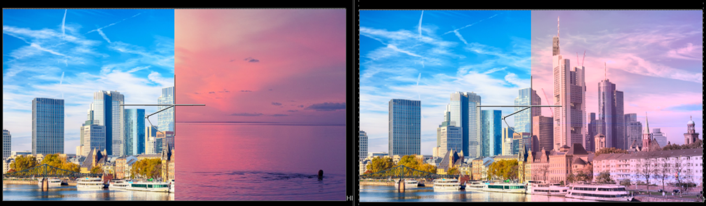
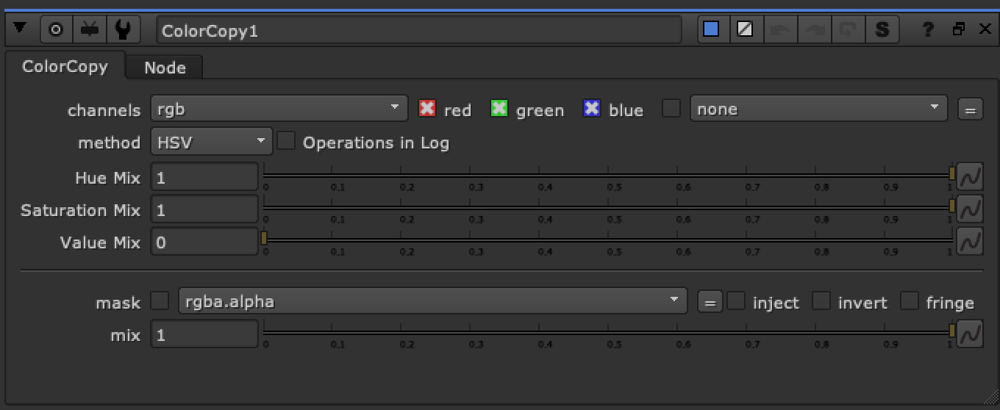

# ColorCopy TL

**Author:** Tony Lyons - [https://compositingmentor.com](https://compositingmentor.com)

ColorCopy converts A and B images into HSV or HSL colorspace and mixes hue, saturation, and luminance (value) from image A to image B.

The other modes are a way of separating color and luminance from the image by dividing the original image by a desaturated version. The other methods are the methods found in the saturation node: rec709, average, maximum, etc.

When you are on HSV or HSL you have control over hue and saturation separately, and in the rest of the methods have just a single 'color mix' control (along with the luminance mix).

Can toggle Operations to be done in Log space.

