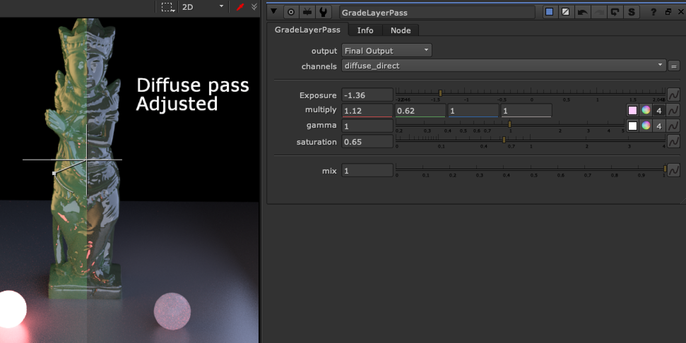

# GradeLayerPass TL

**Author:** Tony Lyons - [https://compositingmentor.com](https://compositingmentor.com)

Useful for grading CG AOVs. Choose AOV from the channels dropdown that you wish to grade. I've chosen the most common grade adjustments (also useful from a lighting artist point of view that translates well back to lighting application).

Exposure - for luminance, Multiply - for color, Gamma - midtones, Saturation.

This tool will minus the AOV layer from the beauty, makes adjustments to the AOV layer, and plus the changed layer back. It also injects the changed AOV layer back into the stream so if you shuffle it out afterwards it will reflect the changes made to the AOV layer.
