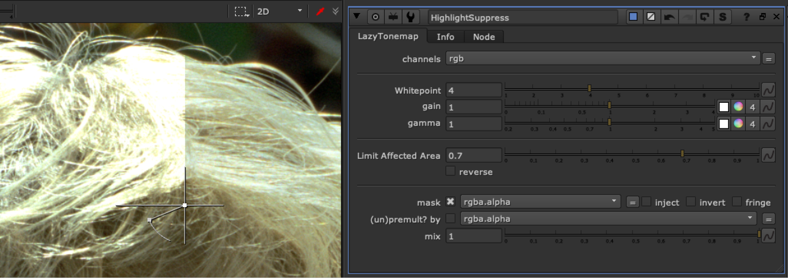

# HighlightSuppress TL

**Author:** Iiro Harra (Originally Lazy_Tonemap) - [https://compositingmentor.com](https://compositingmentor.com)

- [http://www.nukepedia.com/gizmos/colour/lazy_tonemap](http://www.nukepedia.com/gizmos/colour/lazy_tonemap)

Uses expression to try and suppress highlights above 1 to a more aesthetic fall off, retaining color information. When the whitepoint is set to 1, the image will be the same as the original, higher the whitepoint, the stronger the effect. Gain and gamma can be used to compensate for the slight decontrasting that occurs on the image.

Limit Affected Area is a Luminance key on the original image. Setting to 1 will gradually ramp up the effect towards (and above) a value of 1 and helps preserve lows and midtones.
