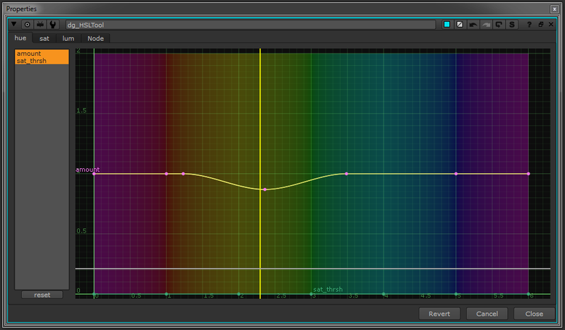
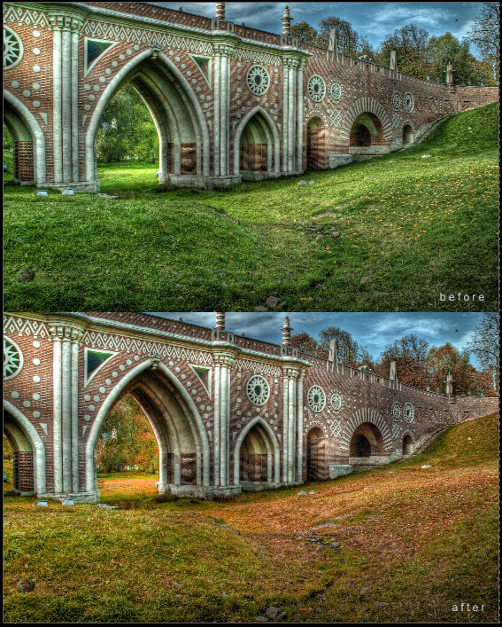

# HSL_Tool NKPD

**Author:** Den Gheiko - [http://www.gheiko.com](http://www.gheiko.com)

- [http://www.nukepedia.com/gizmos/colour/dg_hsltool](http://www.nukepedia.com/gizmos/colour/dg_hsltool)

A kind of DaVinci Resolve 'Hue Vs Hue', 'Hue Vs Sat' and 'Hue Vs Lum' color correction tool.

Curve based adjusting hue, sat and value in a specific hue range.

Adjust the curves, by default, the difference matte from the original image is stored in alpha, so can be used as a subtle keyer.

