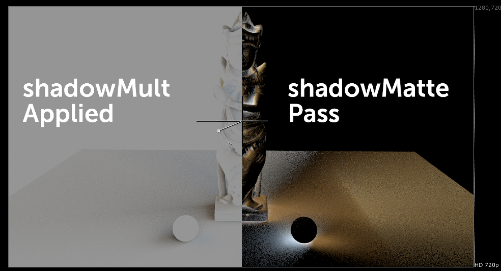

# ShadowMult TL

**Author:** Tony Lyons - [https://compositingmentor.com](https://compositingmentor.com)

Arnold rendering and other renderers enable you to output a layer called "shadowMatte". This can be a bit of a mysterious pass to figure out. Most artists just desaturate the image, shuffle to alpha and use it as a mask to multiply the plate or CG down to 0.

There is in fact color information in the shadowMatte pass. Each channel, red, green, blue, needs to be used as a mask to multiply the corresponding channel.
- shadowMatte.red - used as mask to multiply red to 0
- shadowMatte.green - used as mask to multiply green to 0
- shadowMatte.blue - used as mask to multiply blue to 0
I made this tool to automatically apply this method quickly and effortlessly. Simple additional controls for multiply (in case you want to change color) and gamma.
