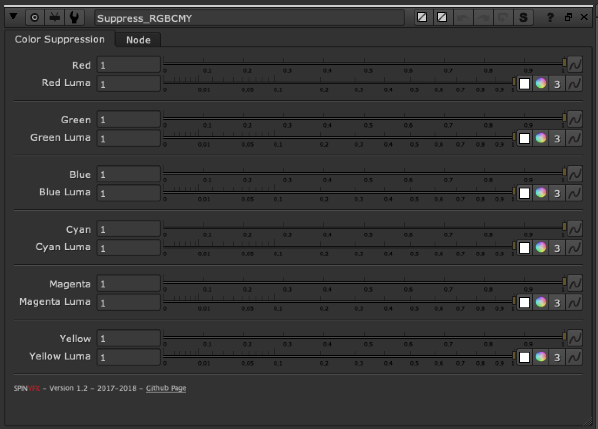

# Suppress_RGBCMY SPIN

**Author:** Spin VFX

- [http://www.nukepedia.com/gizmos/other/spin_nuke_gizmos-1](http://www.nukepedia.com/gizmos/other/spin_nuke_gizmos-1)
- [https://github.com/SpinVFX/spin_nuke_gizmos](https://github.com/SpinVFX/spin_nuke_gizmos)

Suppress (or boost) specific colors: Red, Green, Blue, Cyan, Magenta or Yellow.

